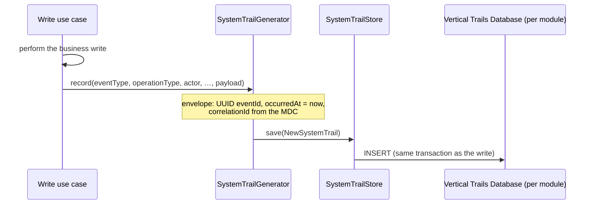

# Audit trails (system trails)

Model City records every **write** operation as a **system trail**: an audit event with a
common envelope and an event-type-specific payload. Trails are **decentralized** — each
vertical owns its own event types, its own `SystemTrailGenerator` and its own
`<vertical>_trails` table — and **read-only** for administrators.

## How a trail is produced

Write use cases call the vertical's `SystemTrailGenerator` (a subclass of
`AbstractSystemTrailGenerator` in `model-city-commons`), which builds the envelope and
persists it through the vertical's `SystemTrailStore` **in the same transaction** as the
business change. There is no create/update/delete API for trails — they are a side effect of
the write.



The correlation id comes from the MDC (see [Observability](./observability.md)), so a trail
can be tied back to the exact request that produced it.

## The envelope

Built by `AbstractSystemTrailGenerator` as a `NewSystemTrail` and stored in the
`<vertical>_trails` table:

| Field | Type | Notes |
| --- | --- | --- |
| `eventId` | UUID | Unique, immutable; generated at source. |
| `eventType` | String | Canonical type, `UPPER_SNAKE_CASE` (e.g. `USER_REGISTERED`). |
| `operationType` | enum | `CREATE`, `UPDATE` or `DELETE`. |
| `occurredAt` | timestamp | UTC instant of the business event. |
| `correlationId` | String | The request's correlation id (distributed trace). |
| `responsibleUserId` | String | Auth0 `sub` of the actor; `SYSTEM` for webhook-triggered events. |
| `responsibleUserRole` | String | Actor role (nullable). |
| `neighbourhoodId` | Long | Neighbourhood scope (nullable). |
| `zoneId` | Long | Zone scope (nullable). |
| `resourceType` | String | Type of the affected resource (e.g. `EVENT_TICKET`). |
| `resourceId` | String | Id of the affected resource (String — supports Auth0 subs). |
| `payload` | JSONB | Self-contained, event-specific detail (serialized JSON). |

`payload` conventions: `CREATE` carries the created resource snapshot; `UPDATE` carries the
new state (optionally a `before`/`after`); `DELETE` carries the last known snapshot.

:::note[Webhook actor]

Stripe-webhook events (`*_CONFIRMED` / `*_CANCELLED`) have no authenticated caller, so they
record the `SYSTEM` actor marker (`AbstractSystemTrailGenerator.SYSTEM_ACTOR`).

:::

## Zone / neighbourhood scope

Only filled when the resource has a direct territorial relation: `users` (the user's
neighbourhood), `civic_questions` and `security_alerts` (their zone + neighbourhood), and
`answers` (inherited from their question). Other resources (city-places, events, cars,
reservations, …) leave them null.

## Event catalogue by vertical

### Core Module

| Event type | Operation | Resource |
| --- | --- | --- |
| `USER_REGISTERED` | CREATE | `USER` |
| `USER_UPDATED` | UPDATE | `USER` |
| `USER_STATUS_CHANGED` | UPDATE | `USER` |
| `USER_DELETED` | DELETE | `USER` |
| `AGENT_INVITED` | CREATE | `AGENT_INVITATION` |
| `OPERATION_AUTHORIZATION_CREATED` | CREATE | `OPERATION_AUTHORIZATION` |
| `OPERATION_AUTHORIZATION_VERIFIED` | UPDATE | `OPERATION_AUTHORIZATION` |
| `OPERATION_AUTHORIZATION_BURNT` | UPDATE | `OPERATION_AUTHORIZATION` |

### Engagement Module

| Event type | Operation | Resource |
| --- | --- | --- |
| `CIVIC_QUESTION_CREATED` | CREATE | `CIVIC_QUESTION` |
| `CIVIC_QUESTION_UPDATED` | UPDATE | `CIVIC_QUESTION` |
| `ANSWER_SUBMITTED` | CREATE | `CIVIC_ANSWER` |
| `SECURITY_ALERT_CREATED` | CREATE | `SECURITY_ALERT` |
| `SECURITY_ALERT_DELETED` | DELETE | `SECURITY_ALERT` |

### Leisure Module

| Event type | Operation | Resource |
| --- | --- | --- |
| `CITY_PLACE_*` / `CITY_ROUTE_*` (`CREATED`/`UPDATED`/`DELETED`) | CREATE/UPDATE/DELETE | `CITY_PLACE` / `CITY_ROUTE` |
| `PUBLIC_SPACE_*` / `RESERVABLE_RESOURCE_*` | CREATE/UPDATE/DELETE | `PUBLIC_SPACE` / `RESERVABLE_RESOURCE` |
| `SPACE_RESERVATION_CREATED` / `SPACE_RESERVATION_DELETED` | CREATE/DELETE | `SPACE_RESERVATION` |
| `EVENT_*` (`CREATED`/`UPDATED`/`DELETED`) | CREATE/UPDATE/DELETE | `EVENT` |
| `EVENT_TICKET_PURCHASED` | CREATE | `EVENT_TICKET` |
| `EVENT_TICKET_CONFIRMED` / `CANCELLED` (Stripe) | UPDATE | `EVENT_TICKET` |
| `EVENT_TICKET_REFUNDED` / `AUTO_REFUNDED` | UPDATE | `EVENT_TICKET` |

### Mobility Module

| Event type | Operation | Resource |
| --- | --- | --- |
| `CAR_REGISTERED` | CREATE | `CAR` |
| `STREET_RESERVATION_CREATED` / `RENEWED` | CREATE | `STREET_RESERVATION` |
| `STREET_RESERVATION_CONFIRMED` / `CANCELLED` (Stripe) | UPDATE | `STREET_RESERVATION` |
| `SANCTION_ISSUED` | CREATE | `SANCTION` |

### Example payload

```json
{
  "answerId": 5012,
  "questionId": 42,
  "citizenSub": "auth0|abc",
  "vote": "YES",
  "questionNeighbourhoodId": 7,
  "questionZoneId": 3
}
```

## The admin read API

Each vertical exposes its **own** `GET /system-trails` (a `SystemTrailController` per
vertical). All endpoints are **admin-only** (`MODEL-CITY-PLATFORM-ADMIN`) and reached under
`/api/<vertical>/system-trails`.

| Query param | Type | Notes |
| --- | --- | --- |
| `eventType` | String | Exact type, one at a time (e.g. `SANCTION_ISSUED`). |
| `responsibleUserId` | String | Actor's Auth0 `sub` — used for the per-user activity view. |
| `from` / `to` | ISO-8601 | Inclusive bounds on `occurredAt`. |
| `page` | int | 0-based; **page size 20**, ordered by `occurredAt` descending. |

The response is a Spring `Page<SystemTrailDto>` (serialized via `PageJacksonModule`). Because
each module owns its own events, types cannot be mixed across modules — the caller picks one
module per query. This also powers the admin panel's per-user activity view by querying one
or more modules with `responsibleUserId={userId}`.

:::info[Design notes]

`eventId` (UUID) lets consumers deduplicate; `occurredAt` + `eventId` gives a total order. If
a payload ever changes incompatibly, a `schemaVersion` field can be added to the envelope and
consumers should tolerate unknown fields (open-world assumption).

:::
