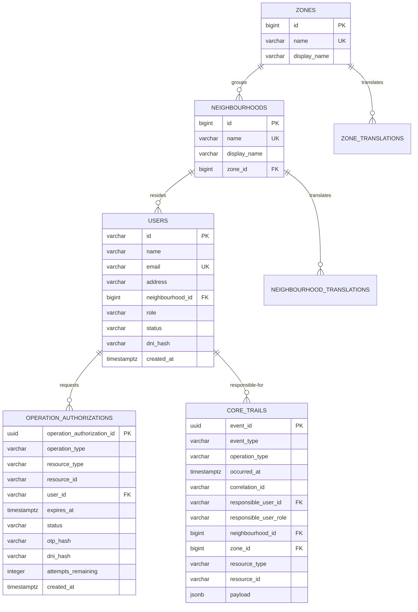
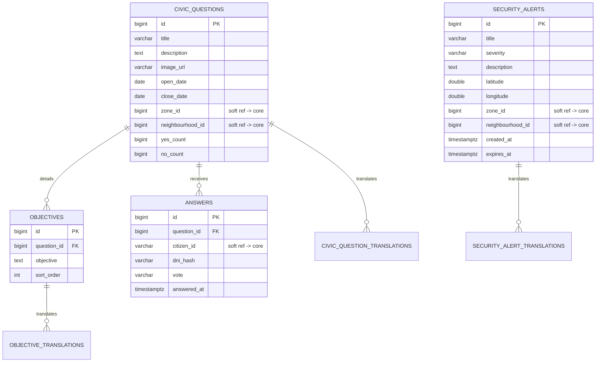
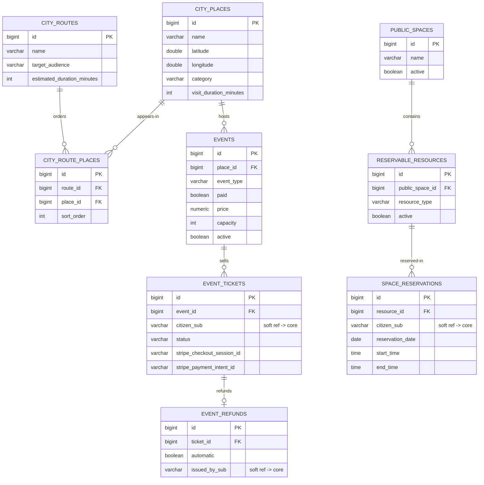
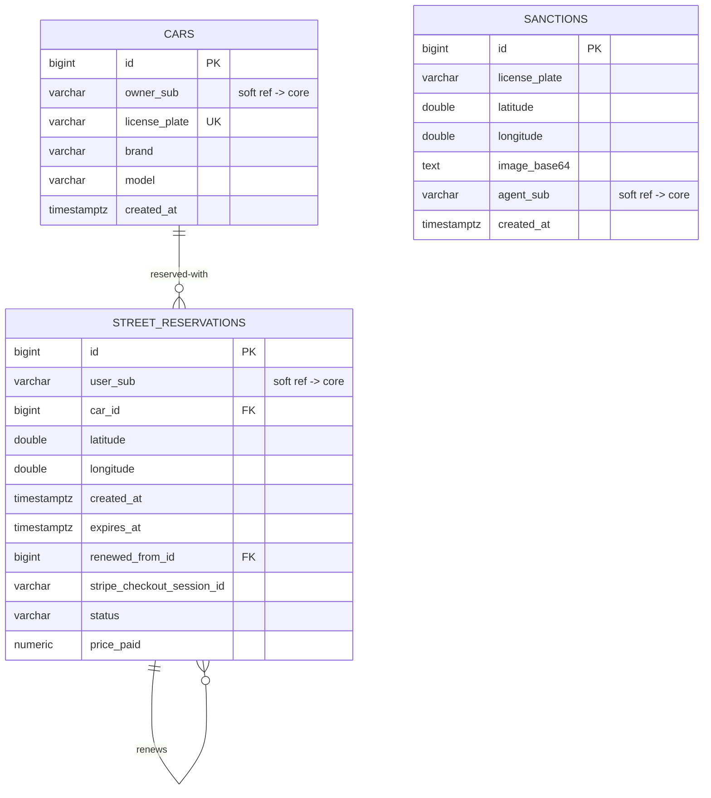
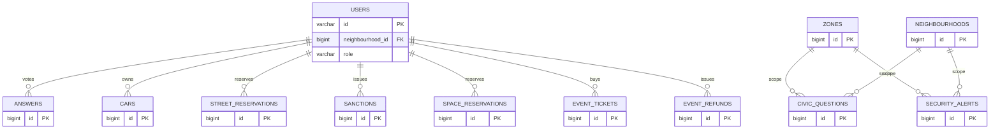

# Data model

Model City persists to **PostgreSQL**. The schema exists in two shapes that share the same
tables, columns and constraints — what differs is the referential integrity across
verticals:

- **Microservices** — one database per data-owning vertical: `modelcity-core`,
  `modelcity-engagement`, `modelcity-mobility`, `modelcity-leisure`. Cross-vertical
  references are **soft ids** (no `FOREIGN KEY`, because the referenced row lives in another
  service's database).
- **Monolith** — a single `modelcity` database where those same soft ids become **real
  foreign keys** against the `core`-owned tables (`users`, `zones`, `neighbourhoods`).

Diagrams use Mermaid `erDiagram`. See [Dual topology](./dual-topology.md) for the runtime
consequences of the split.

## Cross-cutting conventions

### Identifiers

- Business and reference tables use a surrogate `BIGSERIAL` primary key (`id`). The
  exceptions are `users`, whose PK is the **Auth0 `sub`** (`VARCHAR(128)`, external and
  immutable), and `operation_authorizations`, whose PK is an application-generated `UUID`.
- Internal `name` columns (zones, neighbourhoods, …) are kebab-case and uniquely
  constrained; `display_name` is the human-readable label.

### Soft references vs. real foreign keys

The structural difference between topologies concentrates on the columns that cross a
vertical boundary (typically toward `users`, `zones` or `neighbourhoods`, owned by `core`):
`citizen_sub`, `owner_sub`, `agent_sub`, `user_sub`, `zone_id`, `neighbourhood_id`, …

- In **microservices** they are soft references with **no** `FOREIGN KEY`; integrity is
  enforced at the application layer (the gateway propagates `sub` via `X-Auth-Sub`, and
  `CoreClient` resolves name/role).
- In the **monolith** they become **real foreign keys**, yielding a fully integral
  relational model.

### Internationalization

Localizable content follows the **side translation table** pattern: the base row keeps the
Spanish (`es`) value as fallback, and a `<entity>_translations` table stores the other
locales, keyed `(<entity>_id, locale)` with a `FOREIGN KEY … ON DELETE CASCADE`. See
[Internationalization](./internationalization.md).

### Audit trails

Each vertical keeps a `<vertical>_trails` table recording write operations. In
microservices the responsible user/zone/neighbourhood are soft refs; in the monolith they
are foreign keys `ON DELETE SET NULL` (deleting a user anonymizes their trail rather than
removing it). See [Audit trails](./audit-trails.md).

## Core Module

`core` owns identity and the territorial hierarchy, so **all its internal relations are real
foreign keys even in microservices**. Other verticals reach these capabilities through
`CoreClient`, never by direct database access.

- **`zones` / `neighbourhoods`** — two-level territorial hierarchy (`zone → neighbourhood`).
  `neighbourhoods.zone_id` is `ON DELETE RESTRICT`.
- **`users`** — citizens and staff, keyed by the Auth0 `sub`. `role` is one of
  `MODEL_CITY_PLATFORM_ADMIN`, `MODEL_CITY_OPERATOR`, `MODEL_CITY_BACKOFFICE`,
  `MODEL_CITY_MOBILITY_AGENT`, `MODEL_CITY_CITIZEN`; `status` is `ACTIVE`/`DISABLED`.
  `dni_hash` is an irreversible HMAC of the DNI set on first certificate verification.
- **`operation_authorizations`** — single-use OTP challenges for sensitive operations.
  The code is never stored in clear (`otp_hash`), with a lifecycle
  (`PENDING → VERIFIED → BURNT` / `EXPIRED`) and a bounded `attempts_remaining`.

## Engagement Module

Citizen participation: **civic questions** (with objectives, voted YES/NO) and geolocated
**security alerts**.

- **`civic_questions`** keeps denormalized `yes_count` / `no_count` for fast reads.
- **`answers`** deduplicates one vote per verified DNI and question via
  `uq_answers_dni (question_id, dni_hash)`; no PII is stored in clear.
- **`security_alerts`** carry `severity` (`IMPORTANT`/`MEDIUM`/`MILD`) and are considered
  inactive once `expires_at` is in the past.

## Leisure Module (`modelcity-leisure`)

The largest vertical: **city-places**, **city-routes** (N:M via `city_route_places`),
**public-spaces** with reservable resources and reservations, and ticketed **events**.

- **`events`** enforce cross-column consistency: `paid ⇒ price > 0`, `¬paid ⇒ price = 0`
  and `paid ⇒ requires_ticket`. Soft-deleted via `active`.
- **`event_tickets`** carry **both** Stripe identifiers so the web (Checkout Session) and
  mobile (Payment Intent) purchase flows coexist. Status is one of
  `PENDING`/`PAID`/`PURCHASED`/`CANCELLED`/`REFUNDED`.
- **`event_refunds`** is 1:1 with a ticket (`UNIQUE (ticket_id)`); `automatic` marks refunds
  triggered by deleting an event.

## Mobility Module (`modelcity-mobility`)

Urban mobility: citizen **cars**, **street reservations** (regulated parking paid via Stripe
Checkout) and parking **sanctions**.

- **`street_reservations`** have a Stripe payment lifecycle (`PENDING → PAID`/`CANCELLED`
  via webhook) and a self-reference (`renewed_from_id`) for renewals.
- **`sanctions`** link to `cars` only by `license_plate` at the application level (not a
  FK), so a sanction can be issued against an unregistered vehicle.

## Monolith — consolidated `modelcity` schema

The monolith puts every vertical's tables in one database and materializes the cross-vertical
soft ids as real foreign keys to `core`.

The soft-ref → foreign-key promotion, with delete semantics:

| Table | Column | Microservices | Monolith |
| --- | --- | --- | --- |
| `civic_questions` | `zone_id` / `neighbourhood_id` | soft ref | FK `ON DELETE RESTRICT` |
| `answers` | `citizen_id` | soft ref | FK → `users` `ON DELETE CASCADE` |
| `security_alerts` | `zone_id` / `neighbourhood_id` | soft ref | FK (`RESTRICT` / `SET NULL`) |
| `cars` | `owner_sub` | soft ref | FK → `users` `ON DELETE CASCADE` |
| `street_reservations` | `user_sub` | soft ref | FK → `users` `ON DELETE CASCADE` |
| `sanctions` | `agent_sub` | soft ref | FK → `users` `ON DELETE RESTRICT` |
| `space_reservations` | `citizen_sub` | soft ref | FK → `users` `ON DELETE CASCADE` |
| `event_tickets` | `citizen_sub` | soft ref | FK → `users` `ON DELETE CASCADE` |
| `event_refunds` | `issued_by_sub` | soft ref | FK → `users` `ON DELETE SET NULL` |
| `*_trails` | `responsible_user_id`, `zone_id`, `neighbourhood_id` | soft ref | FK `ON DELETE SET NULL` |

Design consequences: full referential integrity (no orphan votes, tickets, reservations or
sanctions); deleting a citizen **cascades** their personal data but **anonymizes**
(`SET NULL`) the audit trails and staff-issued refunds; a sanction's issuing agent is
protected by `ON DELETE RESTRICT`. All internal per-vertical relations, `CHECK`s, indexes,
translation tables and `*_trails` tables are identical to the microservices schemas.

:::info[Schema ownership]

The schema is applied through the deployable's **Flyway** migrations
(`src/main/resources/db/migration`). Cities add additive `V2+` migrations; adding a column
never conflicts with a platform upgrade. See the
[Extensibility Guide](../extensibility-guide/index.md) and
[Add a database migration](../extensibility-guide/examples/add-a-database-migration.md).

:::
