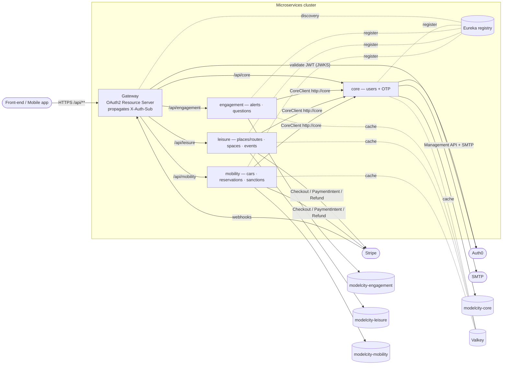
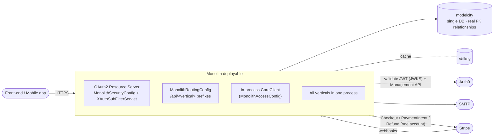

# Dual topology — microservices and monolith

Model City ships the **same product in two topologies** from the same domain libraries:

- **Microservices** (high demand) — `core`, `engagement`, `leisure`, `mobility` behind a
  Eureka service registry and a Spring Cloud Gateway.
- **Monolith** (low demand) — every vertical bundled into a single Spring Boot deployable.

Both share **one implementation** of the business logic. What changes is the **entry
edge**, the **inter-vertical communication** and the **persistence**. A city picks one
topology when it scaffolds its deployable (see the
[Extensibility Guide](../extensibility-guide/index.md)).

## Microservices topology

Each microservice owns its **own database**. Cross-vertical needs go through the
gateway-propagated `X-Auth-Sub` header and `CoreClient` HTTP calls. Stripe webhooks enter
through the gateway's public paths.

## Monolith topology

The monolith has **no Eureka and no inter-service HTTP**: `CoreClient` is in-process, every
vertical shares one PostgreSQL database (with real foreign keys), and a single Stripe
account serves leisure and mobility (each with its own webhook secret).

## What differs, side by side

| Aspect | Microservices | Monolith |
| --- | --- | --- |
| **Entry edge** | The **Gateway** is the single OAuth2 Resource Server: validates the Auth0 JWT (RS256 via JWKS) and propagates the caller's `sub` in `X-Auth-Sub`; routes `/api/{service}/**` by Eureka. | An in-process filter (`MonolithSecurityConfig` + `XAuthSubFilterServlet`): the process itself is the Resource Server. `MonolithRoutingConfig` keeps the `/api/<vertical>` prefixes. |
| **Inter-vertical access** (`CoreClient`) | HTTP call to `http://core/...` (load-balanced `WebClient` via Eureka). | In-process (`InProcessCoreClient`, registered by `MonolithAccessConfig`): calls the local `core` repositories/use cases directly, no network. |
| **Persistence** | One database **per vertical** (`modelcity-core`, `modelcity-engagement`, `modelcity-mobility`, `modelcity-leisure`); cross-vertical references are **soft ids**. | A **single** `modelcity` database with **real foreign keys** across verticals. |
| **Public routes** (no JWT) | The gateway lets them through (certificate verify, Stripe webhooks, `/actuator/health`). | `MonolithSecurityConfig` lists the same paths in its `permitAll` set. |
| **Stripe / Auth0 / SMTP** | Same integrations in both. | Same, with one Stripe account shared by leisure and mobility. |

## How one codebase serves both

The divergence is contained by the **ports-and-adapters** split:

- **Shared in `*-domain`** — controllers, use cases, DTOs, views and store ports. Identical
  HTTP surface and business behaviour in both topologies.
- **Per-topology in `*-domain-{microservices,monolith}`** — the JPA entities, repositories
  and `*StoreAdapter`s. The microservices entities use *soft ids* (`Long zoneId`,
  `String citizenSub`, …); the monolith entities add real `@ManyToOne` foreign-key
  navigations because everything shares one database.
- **`core`** owns its own data, so its entities are shared directly from
  `model-city-core-domain` (no soft-id↔FK split) and its use cases use repositories without
  an intermediate store.

Cross-cutting seams that genuinely differ are abstracted rather than duplicated:
`CoreClient` (HTTP vs in-process), the entry-edge security filter (`XAuthSubFilterReactive`
on the reactive gateway vs `XAuthSubFilterServlet` in the servlet apps), and the Stripe
configuration (shared, with leisure using explicit bean names so it coexists with mobility
inside the monolith).

:::note[Method-level authorization]

Protected endpoints resolve the caller's role through `CoreClient` (HTTP in microservices,
in-process in the monolith) via the `ModelCityAccessAspect` `@Before` advice. The full
chain — including the `userProfile` cache — is documented per operation in the
**Modules & REST API** section.

:::

## Related

- [Data model](./data-model.md) — the soft-ref vs foreign-key split in detail.
- [Observability](./observability.md) — how the correlation id follows a request across
  services in the microservices topology.
