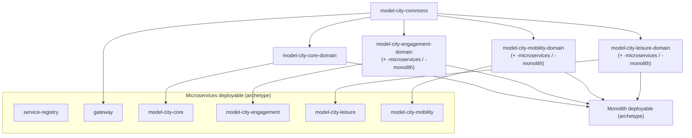

# Back-end architecture

**Model City** back-end is a **Spring Boot (Java 25)** platform that exposes the REST
APIs behind the citizen-facing portal and mobile app. It is built from a set of shared
**domain libraries** and shipped in **two deployment topologies from the same source**:

- **Microservices** — a Eureka service registry, a Spring Cloud Gateway and one Spring
  Boot app per vertical (`core`, `engagement`, `leisure`, `mobility`).
- **Monolith** — the same verticals assembled into a single deployable.

Both topologies share **one implementation** of the business logic (controllers, use
cases, DTOs, ports). What differs is the entry edge, how verticals talk to each other,
and the persistence layer. See [Dual topology](./dual-topology.md).

## The domain-library model

The business code of every vertical is extracted into deployment-agnostic
**`model-city-<vertical>-domain`** libraries. The genuinely topology-specific pieces (the
JPA persistence adapters) live in thin per-topology submodules. Everything is aggregated
by the `model-city-back-end-domain` reactor and published to Maven Central under the
`io.github.unircs` group.

## Building blocks

Each vertical follows the same hexagonal layering. Controllers and use cases never touch
JPA entities directly; they work against **views** (read interfaces) and **stores**
(persistence ports) that the per-topology adapters implement.

| Concept | Lives in | Purpose |
| --- | --- | --- |
| **Controller** (`*Controller`) | `*-domain` | `@RestController`; identical HTTP surface in both topologies. |
| **Use case** (`*UseCase`) | `*-domain` | Business logic; depends on ports, never on JPA entities. |
| **DTO** (`*Dto`, `*RequestDto`) | `*-domain` | External request/response contract. |
| **View** (`*View`) | `*-domain` | Read-only projection interface the entity implements. |
| **Store / port** (`*Store`) | `*-domain` | Persistence interface (one per aggregate). |
| **Entity** (`@Entity`) + **Repository** | `*-domain` / `*-domain-{microservices,monolith}` | JPA mapping; may diverge per topology. |
| **Store adapter** (`*StoreAdapter`) | `*-domain-{microservices,monolith}` | `@Component` implementing the port over the repository. |

## In this section

| Page | What it covers |
| --- | --- |
| [Dual topology](./dual-topology.md) | Microservices vs monolith: entry edge, inter-vertical calls (`CoreClient`), per-DB vs single-DB persistence, and how one codebase serves both. |
| [Data model](./data-model.md) | The entity-relationship model per vertical database and the consolidated monolith schema, plus the cross-cutting conventions (soft refs vs FKs, i18n tables, audit tables). |
| [Cache](./cache.md) | The Valkey/Redis distributed cache: the global toggle, per-cache TTLs, keying (including per-language keys) and eviction. |
| [Internationalization](./internationalization.md) | Supported locales, side translation tables, `Accept-Language` negotiation, and the multi-language write payloads. |
| [Observability](./observability.md) | The correlation id propagated across layers and services, the MDC log pattern and the DEBUG HTTP logging filter. |
| [Audit trails](./audit-trails.md) | The system-trail envelope, the per-vertical event catalogue and the read-only admin API. |
