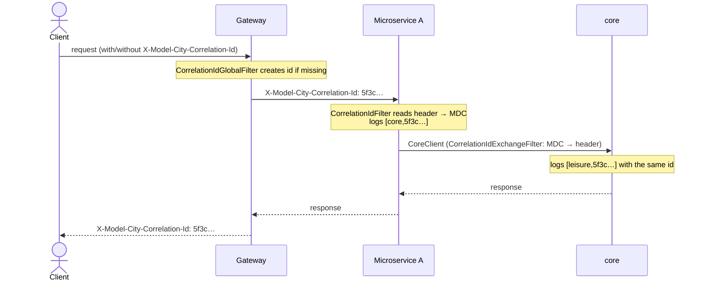

# Observability — log correlation

The first phase of observability is **log correlation**: given one identifier, retrieve
every log line produced while serving a single request — whether it ran in the monolith or
was spread across microservices.

## The correlation id

Every incoming request carries a unique **correlation id**. It travels between processes in
an HTTP header and is exposed to the logging system through the SLF4J **MDC**, so it appears
automatically on each log line.

| Element | Value |
| --- | --- |
| HTTP header | `X-Model-City-Correlation-Id` |
| MDC key | `modelCityCorrelationId` |
| Generation | `UUID.randomUUID()` when the incoming request has no header |

The constants and `resolveOrCreate(...)` helper live in
`com.modelcity.common.observability.model.CorrelationId`.

:::note[Create / reuse rule]

At the **first entry point** (gateway, microservice or monolith): if the request carries
`X-Model-City-Correlation-Id`, it is **reused**; otherwise a random UUID is **created**. From
there it propagates unchanged on every hop and is returned on the response — so a client can
pin its own id and see it end to end.

:::

## Components

The servlet-side logic lives in `model-city-commons`, so it applies equally to the
**monolith** and the **four vertical microservices** (all depend on commons). The
**gateway** is reactive (WebFlux) and does not depend on commons, so it replicates the entry
filter.

| Component | Module | Responsibility |
| --- | --- | --- |
| `CorrelationId` | commons | Header/MDC constants and `resolveOrCreate(...)`. |
| `CorrelationIdFilter` | commons | Servlet filter (`OncePerRequestFilter`, `HIGHEST_PRECEDENCE`): resolves/creates the id, puts it in the MDC, returns it on the response and clears it. |
| `HttpLoggingFilter` | commons | Logs full HTTP request/response at **DEBUG** (see below). |
| `CorrelationIdExchangeFilter` | commons | `WebClient` `ExchangeFilterFunction`: reads the id from the MDC and adds it to outgoing calls (inter-service propagation). |
| `ModelCityObservabilityAutoConfiguration` | commons | Registers the filters. Toggle `modelcity.observability.correlation.enabled` (default `true`). |
| `CorrelationIdGlobalFilter` | gateway | Reactive `GlobalFilter` (order `-120`): the entry point in microservices; creates/reuses the id, propagates it downstream and returns it. |

`CorrelationIdFilter` runs at `HIGHEST_PRECEDENCE`, **before Spring Security**, so even
rejected requests (401/403) are logged with their correlation id.

## Propagation

In **microservices**, the same id appears in the gateway, the calling service and any
downstream service reached through `CoreClient`:



In the **monolith** there are no network hops, but the id still correlates every in-process
layer (filters, security, controllers, use cases) of the same request.

## Log pattern

Defined in `modelcity-shared.yml` (imported by the monolith and the four verticals) and in
the gateway's `application.yml`:

```yaml
logging:
  pattern:
    level: "%5p [${spring.application.name:},%X{modelCityCorrelationId:-}]"
```

Each line shows `[<application>,<correlationId>]`; when there is no id yet (e.g. startup
tasks) it prints `-`:

```
INFO  [core,5f3c1b9a-…] c.m.core.users.controller.UsersController : ...
```

## HTTP request/response logging (DEBUG)

`HttpLoggingFilter` logs the full request and response (method, URI, query, headers, body;
status, duration, body) **only when its logger is at DEBUG**. At the default `INFO` level the
filter passes the request through unwrapped, so there is **no buffering cost** in production.

Enable per application with:

```yaml
logging:
  level:
    com.modelcity.common.observability: DEBUG
```

:::danger[Bodies are logged verbatim]

Request/response bodies are logged **without redaction** and may contain OTPs, Auth0 tokens,
Stripe payloads/signatures and citizen PII. **Never enable DEBUG for this package in
production** or any deployment handling real data.

:::