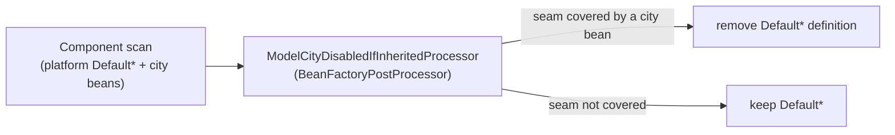

# Extensibility & city overrides

The platform ships **default** business logic (use cases), **default** REST controllers and
**default** persistence in the published `*-domain` libraries. A city can replace or extend
any of them — and add brand-new entities, use cases and endpoints — **without editing
platform code**, so it can adopt new non-MAJOR platform versions and keep its
customizations. This section explains the one override mechanism, then gives a **library of
worked examples**, one per kind of customisation.

:::tip[Start here, then copy an example]

Read this page once to understand the seam model, then jump to the example below that
matches what you want to change. Every example names the exact seam, the city files to add,
whether a database migration is needed, and how to verify it.

:::

## 1. How a city relates to the platform

A city back-end is scaffolded from one of the two
[Maven archetypes](../../how-to-start/scaffolding.md#2-back-end-maven-archetypes) and
depends on the published libraries (`io.github.unircs:*-domain`). It **owns no platform
persistence or business source** — only its application class(es), configuration, Flyway
migrations and whatever overrides it chooses to add under the already-scanned
`com.modelcity.<vertical>` base package.

Because the city's beans are component-scanned alongside the platform defaults, adding a
class is all it takes: the platform default for that seam **backs off automatically** at
startup and the city bean wins deterministically.

## 2. The override mechanism (one seam, one rule)

Every overridable default is a normal Spring bean registered by component scanning: it
carries its usual stereotype (`@Service`, `@RestController`, `@Component`) **plus** the
platform marker `@ModelCityDisabledIfInherited`.

At startup, `ModelCityDisabledIfInheritedProcessor` — a `BeanFactoryPostProcessor`
registered for every app by `ModelCityExtensibilityAutoConfiguration` in
`model-city-commons` — runs after all bean definitions are known but **before any bean is
instantiated**. For each annotated default it resolves the seam (the most derived
`@ModelCityExtensionPoint` type in its hierarchy — a use-case interface, an abstract
controller base or a store port) and, if another bean already covers that seam, **removes
the default's bean definition**. The city bean therefore wins deterministically.



There is exactly **one** mechanism — no `@Primary`, no scan exclusions, no per-vertical
auto-configuration catalogs. The `@ModelCityDisabledIfInherited`-annotated `Default*`
classes are the greppable catalog of what a city may override:

```bash
# Every overridable platform default, across every vertical:
grep -rl "@ModelCityDisabledIfInherited" --include=*.java

# Every seam (the stable contracts a city may implement/extend):
grep -rl "@ModelCityExtensionPoint" --include=*.java
```

### The four override doors

The marker is deliberately **not** `@Inherited`, so a city bean opts in by covering the seam
through any of the usual doors:

| Door | When to use | Example |
| --- | --- | --- |
| **`implements` the use-case interface** | change how one piece of business logic behaves | `class MyGetEventsUseCase implements GetEventsUseCase<EventSummaryDto>` |
| **`extends` the abstract controller** | override an endpoint or add new ones | `class MyEventController extends EventController<…>` |
| **`extends` the `Default*`** | reuse the platform body and tweak one method (e.g. drop caching) | `class MyGetEventsUseCase extends DefaultGetEventsUseCase` |
| **`implements` the store port** | swap the persistence adapter | `class MyEventStore implements EventStore<Event, EventRequestDto>` |

A brand-new use case, entity or endpoint that has **no** platform seam is even simpler: it
is just a plain `@Service` / `@Entity` / `@RestController` under `com.modelcity.<vertical>`;
there is no default to back off.

### Naming convention

- The **extension point** keeps the plain name: a single-method interface (`GetEventsUseCase`)
  for a use case, an abstract base class (`EventController`) for a controller, or a port
  interface (`EventStore`) for persistence. This is the stable SPI; breaking it is a MAJOR
  change.
- The platform default is `Default<Name>` (`DefaultGetEventsUseCase`, `DefaultEventController`,
  `DefaultEventStore`).
- Defaults are **city-neutral** — no city name ever appears in a platform class (enforced by
  ArchUnit).

## 3. Anatomy of a vertical slice

Every aggregate (events, city-places, sanctions…) follows the same hexagonal layering, and
each layer is a seam a city can reach:

| Concept | Type | Lives in | A city overrides it by… |
| --- | --- | --- | --- |
| **Controller** | abstract `*Controller` (`@ModelCityExtensionPoint`) | `*-domain` | extending it (`@RestController`) |
| **Use case** | single-method `*UseCase` interface (`@ModelCityExtensionPoint`) | `*-domain` | implementing it (`@Service`) |
| **DTO** | `*Dto` / `*RequestDto` (plain extensible class) | `*-domain` | subclassing it |
| **View** | `*View` read-only interface | `*-domain` | extending it for extra read fields |
| **Store / port** | `*Store` interface (`@ModelCityExtensionPoint`) | `*-domain` | implementing it (`@Component`) |
| **Entity + Repository** | `*Base` `@MappedSuperclass` + thin `@Entity` + `@NoRepositoryBean` generic repo | `*-domain` / `*-domain-{microservices,monolith}` | subclassing the base entity and binding the repo |

Invariant persistence lives in the shared `*-domain`; the topology-divergent entities (the
monolith's real `@ManyToOne` foreign keys vs the microservices' soft ids) live in
`*-domain-{microservices,monolith}`. See [Data model](../architecture/data-model.md) and
[Dual topology](../architecture/dual-topology.md).

:::warning[Caching/transactions live on the default]

`@Cacheable` / `@CacheEvict` / `@Transactional` are declared on the platform **default**
implementation. Annotations are **not** inherited across separate implementations, so a city
that re-implements a use case and wants the same behaviour must re-declare them. Conversely,
**omitting** `@Cacheable` in an override is exactly how you disable caching for one use case
while the rest keep theirs — see
[Disable caching for a use case](./examples/disable-caching-for-a-use-case.md) and
[Cache](../architecture/cache.md).

:::

## 4. The contract, enforced by ArchUnit

Each seam is annotated `@ModelCityExtensionPoint` (in commons). Shared ArchUnit rules
(`ExtensionPointRules`, shipped from the commons test-jar and applied per vertical) enforce:

- **City-neutral defaults** — no platform class carries a city name.
- **The marker only marks a real seam** — allowed only on interfaces or abstract classes.
- **Overrides enter only through a seam** — every `Default*` implements/extends a
  `@ModelCityExtensionPoint` type (a `Default*Repository` may instead bind a
  `@NoRepositoryBean` generic repository, the Spring-Data-native persistence seam).
- **Defaults are scanned and disableable** — every concrete `Default*` carries a stereotype
  **and** `@ModelCityDisabledIfInherited`.
- **Single responsibility** — a use-case seam exposes exactly one method.
- **Store ports are seams** — every `*Store` interface carries the marker.

## 5. Versioning

Use-case interfaces, store ports and controller endpoint signatures are the SPI. Changing
them is a **MAJOR** release; adding new use cases / endpoints is **MINOR**. Cities should
only need to react to MAJOR bumps.

## Examples

One worked recipe per kind of customisation. Each names the exact seam, the city files to
add, whether a Flyway migration is needed, and how to verify it.

**Data model & schema**

- [Add an internal-only field](./examples/add-an-internal-field.md)
- [Expose a new field on the API (end-to-end)](./examples/expose-a-new-api-field.md)
- [Add a new query or filter](./examples/add-a-query-or-filter.md)
- [Add a database migration (schema & seed data)](./examples/add-a-database-migration.md)

**Business logic (use cases)**

- [Override a read use case](./examples/override-a-read-use-case.md)
- [Override a write use case](./examples/override-a-write-use-case.md)
- [Add a brand-new use case](./examples/add-a-new-use-case.md)

**Web layer (controllers & endpoints)**

- [Override an existing endpoint](./examples/override-an-endpoint.md)
- [Add a brand-new endpoint](./examples/add-a-new-endpoint.md)
- [Change an endpoint's role restriction](./examples/change-endpoint-access.md)

**Persistence adapters**

- [Replace a persistence adapter (store)](./examples/replace-a-store-adapter.md)

**A whole new capability**

- [Add a new entity end-to-end](./examples/add-a-new-entity.md)

**Configuration (YAML)**

- [Disable caching for a single use case](./examples/disable-caching-for-a-use-case.md)
- [Tune the cache (toggle & TTLs)](./examples/tune-the-cache.md)
- [Override a platform configuration property](./examples/override-a-config-property.md)
