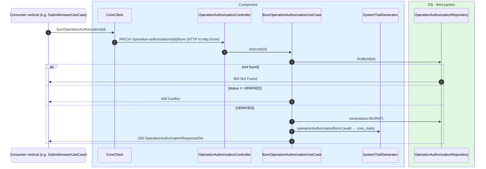
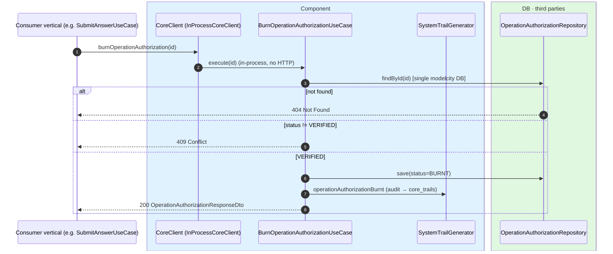

# Burn operation authorization

`PATCH /api/core/operation-authorizations/{id}/burn` → `BurnOperationAuthorizationUseCase`

Marks a `VERIFIED` authorization as `BURNT`, **once the protected operation has actually run**,
so it cannot be reused (a verified OTP is good for a single operation). Only a `VERIFIED`
authorization can be burnt; any other state returns `409`. If the id does not exist, `404`.
Records the `OPERATION_AUTHORIZATION_BURNT` audit event.

It is invoked by the service that performed the operation, via `CoreClient`, right after
persisting it. In the civic-vote flow, engagement validates the authorization (`GET`), records
the vote, and then calls `burn` to invalidate it.

Like [get-operation-authorization](./get-operation-authorization.md): in **microservices**
`CoreClient.burnOperationAuthorization(id)` is an HTTP call through the controller; in the
**monolith** `InProcessCoreClient` calls `BurnOperationAuthorizationUseCase.execute(id)`
directly, with no controller and no network.

## Inputs

**`PATCH /api/core/operation-authorizations/{id}/burn`** — no body.

## Outputs

- **`200 OK`** — authorization burnt (`OperationAuthorizationResponseDto` with `status: BURNT`).
- **`404 Not Found`** — the authorization does not exist.
- **`409 Conflict`** — the authorization was not `VERIFIED`.

## Sequence — microservices

## Sequence — monolith

