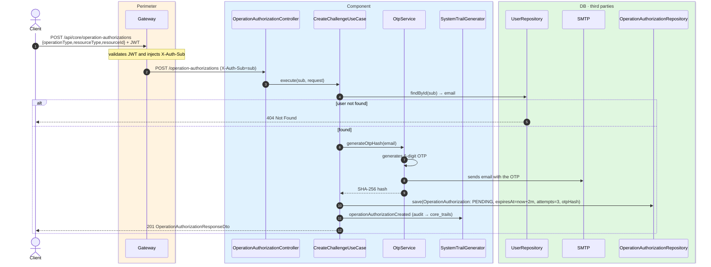
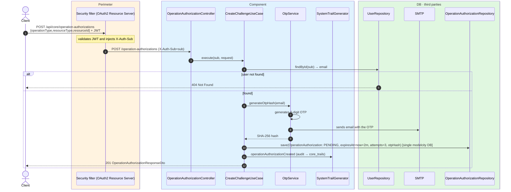

# Create challenge (send OTP)

`POST /api/core/operation-authorizations` → `CreateChallengeUseCase`

Starts a second-factor authorization (OTP by email) for a sensitive operation a citizen is
about to perform in another domain — e.g. **confirming a vote** on a civic question
(`CONFIRM_ANSWER` / `public-question`). The body describes *what* operation to authorize
(`operationType`, `resourceType`, `resourceId`); the citizen's identity does **not** travel in
the body — it is taken from `X-Auth-Sub`.

The use case resolves the user's email from the `sub` (if not found → `404`), asks `OtpService`
for a 6-digit code — which is **sent by SMTP** to the email and of which only the SHA-256 hash
is persisted, never the plaintext — and stores an `OperationAuthorization` in `PENDING` state
with a **2-minute** TTL and **3 attempts**. Returns `201` with the created authorization
(including its `operationAuthorizationId`, which the client uses later to validate and to run the
final operation). Records the `OPERATION_AUTHORIZATION_CREATED` audit event. Not cached (it is a
write with the side effect of sending an email).

## Inputs

**`POST /api/core/operation-authorizations`**

```json
{
  "operationType": "CONFIRM_ANSWER",
  "resourceType": "public-question",
  "resourceId": "42"
}
```

## Outputs

- **`201 Created`** — `OperationAuthorizationResponseDto` (the OTP travels by email, never in the
  response).
- **`404 Not Found`** — the `sub` does not match any user.

```json
{
  "operationAuthorizationId": "8f3a9c1e-2b7d-4e6a-9f12-0a1b2c3d4e5f",
  "operationType": "CONFIRM_ANSWER",
  "resourceType": "public-question",
  "resourceId": "42",
  "userId": "auth0|6627f0a1c2d3e4f5a6b7c8d9",
  "expiresAt": "2026-06-17T10:32:00Z",
  "status": "PENDING",
  "attemptsRemaining": 3,
  "createdAt": "2026-06-17T10:30:00Z"
}
```

## Sequence — microservices



## Sequence — monolith


