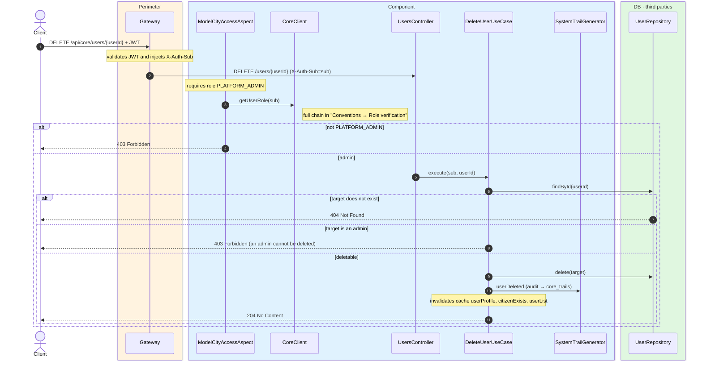
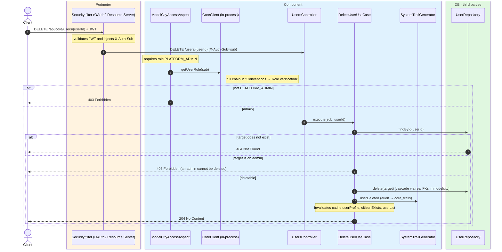

# Delete user

`DELETE /api/core/users/{userId}` → `DeleteUserUseCase`

Permanently removes a user record. **Admin only** (`PLATFORM_ADMIN`, verified by
`ModelCityAccessAspect` through `CoreClient`). As a safeguard, **admin users cannot be
deleted**: if the target is a `PLATFORM_ADMIN`, `403`. If the target does not exist, `404`. On
success, `204 No Content`.

After deleting it records a `USER_DELETED` audit event and invalidates the `userProfile`,
`citizenExists` and `userList` caches.

:::note[Topology difference]

In the **monolith**, the single database with **real foreign keys** cascades the delete
(`ON DELETE CASCADE`) to the citizen's personal data in other verticals (cars, reservations,
tickets, votes) and anonymizes (`ON DELETE SET NULL`) their audit trails. In **microservices**,
each vertical is in its own database, so that propagation does not happen at the database level
(the references are soft). See [Data model](../../architecture/data-model.md).

:::

## Inputs

**`DELETE /api/core/users/{userId}`** — no body.

## Outputs

- **`204 No Content`** — user deleted (no body).
- **`403 Forbidden`** — the target is an admin.
- **`404 Not Found`** — the target does not exist.

## Sequence — microservices

## Sequence — monolith

