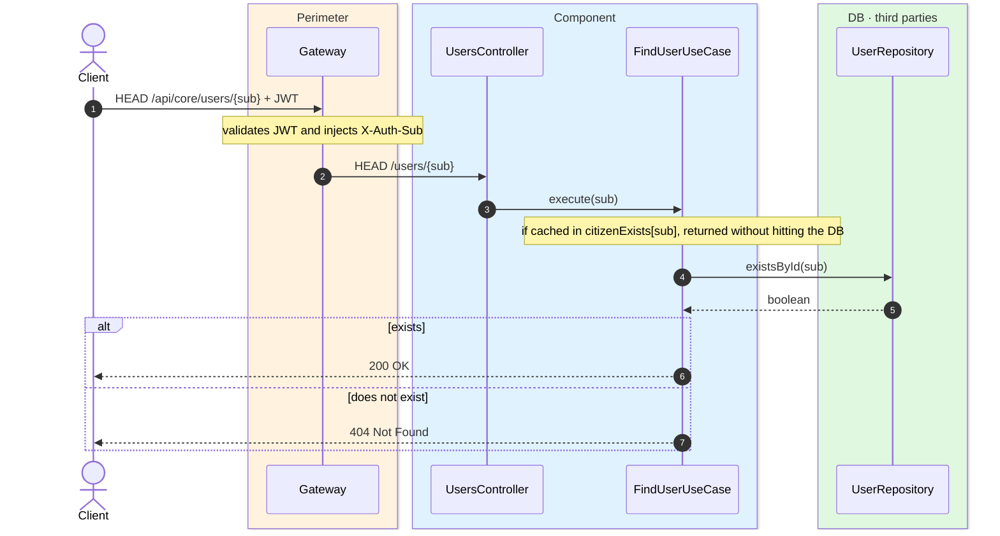
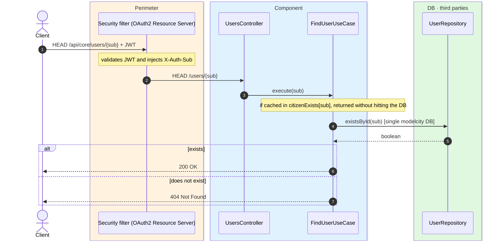

# Check citizen exists

`HEAD /api/core/users/{sub}` → `FindUserUseCase`

A **lightweight** existence check, so the app or front-end can tell whether an Auth0 `sub` is
already provisioned — e.g. to decide between the registration and the normal flow before
requesting an OTP. Being a `HEAD` request it returns **no body**, only the status code:
`200 OK` if the user exists, `404 Not Found` otherwise.

The result is cached in `citizenExists` keyed by `sub`; the entry is invalidated on sign-in and
delete.

## Inputs

**`HEAD /api/core/users/{sub}`** — no body.

## Outputs

- **`200 OK`** — the user exists (no body).
- **`404 Not Found`** — it does not exist (no body).

## Sequence — microservices

## Sequence — monolith

