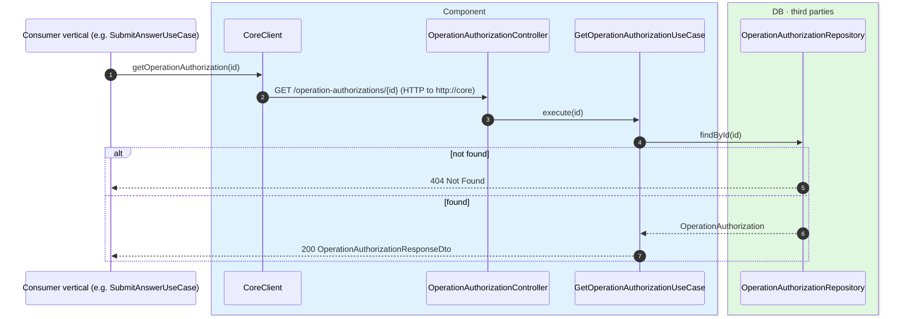
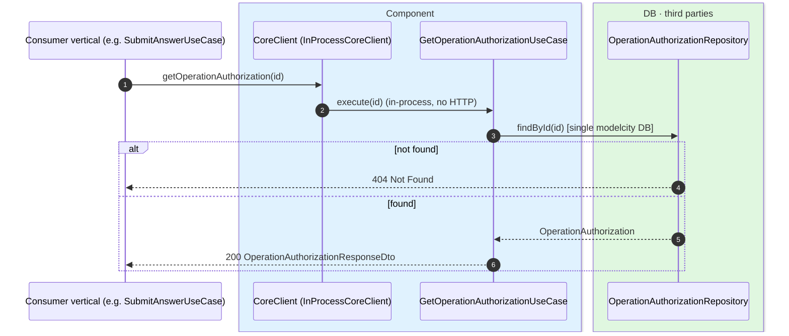

# Get operation authorization

`GET /api/core/operation-authorizations/{id}` → `GetOperationAuthorizationUseCase`

Returns an operation authorization by id. Its main consumer is **not the front-end** but
**other services**: when a domain is about to run the protected operation, it first reads the
authorization to check it is `VERIFIED`, not expired, and that the
`resourceType`/`resourceId`/`userId` match what it intends to do. For example, engagement's
`SubmitAnswerUseCase` reads it before recording a vote. If the id does not exist, `404`.

This is the operation that best illustrates `CoreClient` as a deployment seam:

- In **microservices**, the consumer vertical calls `CoreClient.getOperationAuthorization(id)`,
  which makes an HTTP call to `http://core/operation-authorizations/{id}` (Eureka-balanced
  WebClient); in `core` it goes through the controller and the use case.
- In the **monolith**, `CoreClient` is the in-process implementation (`InProcessCoreClient`,
  `@Primary`), which calls `GetOperationAuthorizationUseCase.execute(id)` **directly, with no
  controller and no network**. The response is identical in both topologies.

## Inputs

**`GET /api/core/operation-authorizations/{id}`** — no body.

## Outputs

- **`200 OK`** — `OperationAuthorizationResponseDto`.
- **`404 Not Found`** — the authorization does not exist.

```json
{
  "operationAuthorizationId": "8f3a9c1e-2b7d-4e6a-9f12-0a1b2c3d4e5f",
  "operationType": "CONFIRM_ANSWER",
  "resourceType": "public-question",
  "resourceId": "42",
  "userId": "auth0|6627f0a1c2d3e4f5a6b7c8d9",
  "expiresAt": "2026-06-17T10:32:00Z",
  "status": "VERIFIED",
  "attemptsRemaining": 3,
  "createdAt": "2026-06-17T10:30:00Z"
}
```

## Sequence — microservices



## Sequence — monolith



> When the consumer is the client app (rather than another vertical), the request enters through
> the usual edge — Gateway in microservices, in-process security filter in the monolith — and
> reaches the same `OperationAuthorizationController`.
