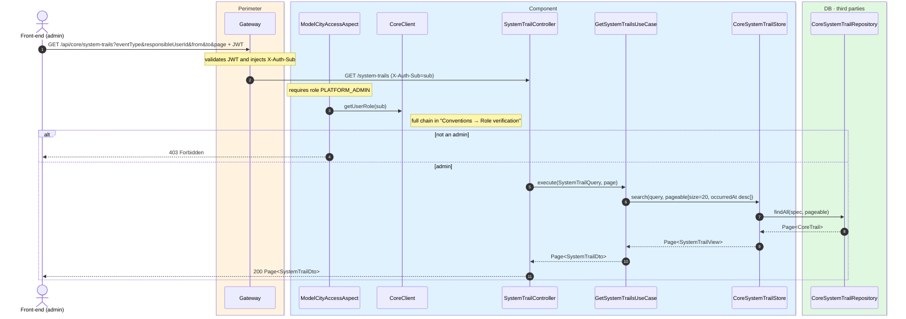
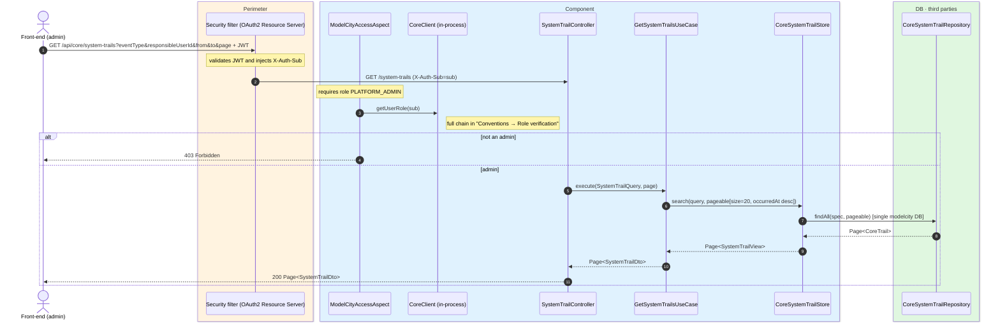

# Query the audit log (core)

`GET /api/core/system-trails` → `GetSystemTrailsUseCase`

**Admin-only** (`PLATFORM_ADMIN`) read of the core vertical's audit log (users + OTP). Returns
a page of 20 events ordered by `occurredAt` descending. Optional filters: `eventType`,
`responsibleUserId`, `from`, `to` (range on `occurredAt`) and `page`.

Events are **written** automatically: each write use case invokes the `SystemTrailGenerator`
(package `com.modelcity.core.trails`) after the operation and within the same transaction. The
generator builds the envelope (id, timestamp, `correlationId` from the MDC), serializes the
`payload` to JSON and persists it via `CoreSystemTrailStore` into the `core_trails` table. This
read queries that same store. See [Audit trails](../../architecture/audit-trails.md).

Vertical event types: `USER_REGISTERED`, `USER_UPDATED`, `USER_DELETED`, `USER_STATUS_CHANGED`,
`AGENT_INVITED`, `OPERATION_AUTHORIZATION_CREATED|VERIFIED|BURNT`.

## Inputs

**`GET /api/core/system-trails?eventType=USER_DELETED&responsibleUserId=&from=&to=&page=0`** — no
body.

## Outputs

- **`200 OK`** — `Page<SystemTrailDto>` (20 per page, `occurredAt` descending).
- **`403 Forbidden`** — the requester is not an admin.

```json
{
  "content": [
    {
      "eventId": "b1e2c3d4-0000-1111-2222-333344445555",
      "eventType": "USER_DELETED",
      "operationType": "DELETE",
      "occurredAt": "2026-06-17T10:30:00Z",
      "responsibleUserId": "auth0|admin",
      "responsibleUserRole": "MODEL-CITY-PLATFORM-ADMIN",
      "resourceType": "user",
      "resourceId": "auth0|6627f0a1c2d3e4f5a6b7c8d9",
      "payload": { "email": "lucia.fernandez@example.com" }
    }
  ],
  "totalElements": 1,
  "totalPages": 1,
  "number": 0,
  "size": 20
}
```

## Sequence — microservices



## Sequence — monolith


