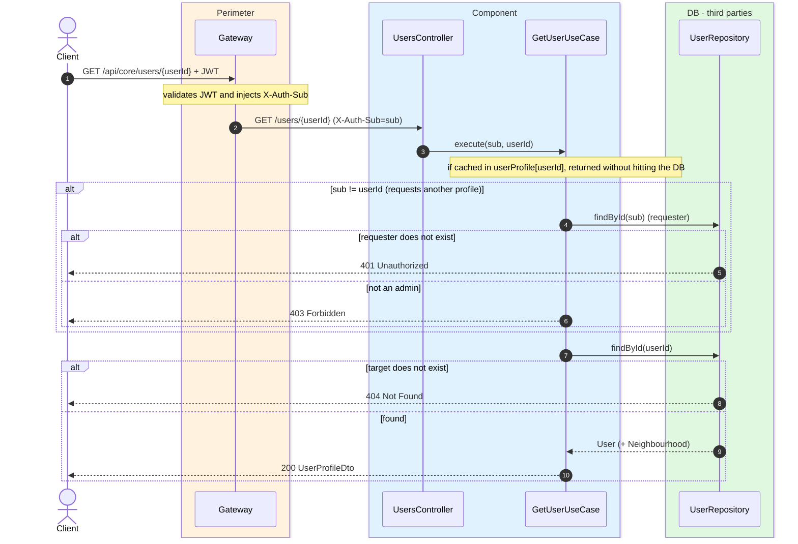
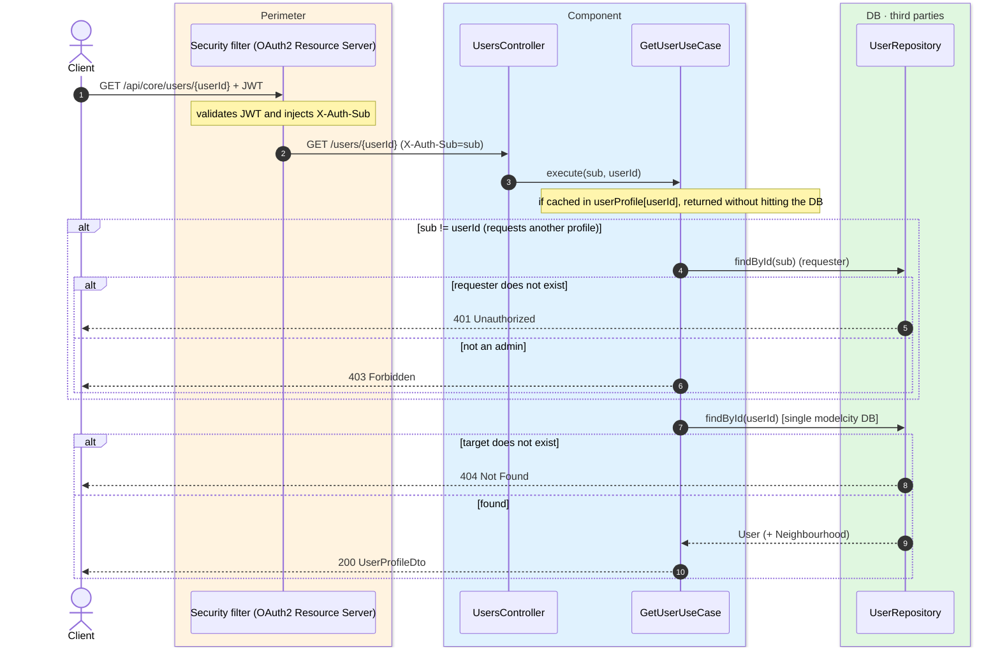

# Get user profile

`GET /api/core/users/{userId}` → `GetUserUseCase`

Returns a user's full profile (personal data, neighbourhood and role). Access control is
**ownership-based**: a citizen can only read **their own** profile (`userId == sub`); a
`PLATFORM_ADMIN` can read anyone's. A non-admin requesting another profile gets `403`; if the
requester does not exist, `401`; if the target does not exist, `404`.

The result is cached in `userProfile` keyed by `userId`, so repeated reads of the same profile
are served from Valkey without hitting the database. Writes to the user (sign-in, delete)
invalidate this entry.

## Inputs

**`GET /api/core/users/{userId}`** — no body.

## Outputs

- **`200 OK`** — `UserProfileDto`.
- **`401 Unauthorized`** — the requester does not exist.
- **`403 Forbidden`** — a citizen requests another user's profile.
- **`404 Not Found`** — the target user does not exist.

```json
{
  "id": "auth0|6627f0a1c2d3e4f5a6b7c8d9",
  "name": "Lucía Fernández",
  "email": "lucia.fernandez@example.com",
  "createdAt": "2026-05-02T08:14:33Z",
  "neighbourhood": { "id": 7, "displayName": "El Recreo Norte", "name": "el-recreo-norte" },
  "role": "MODEL-CITY-CITIZEN"
}
```

## Sequence — microservices



## Sequence — monolith


