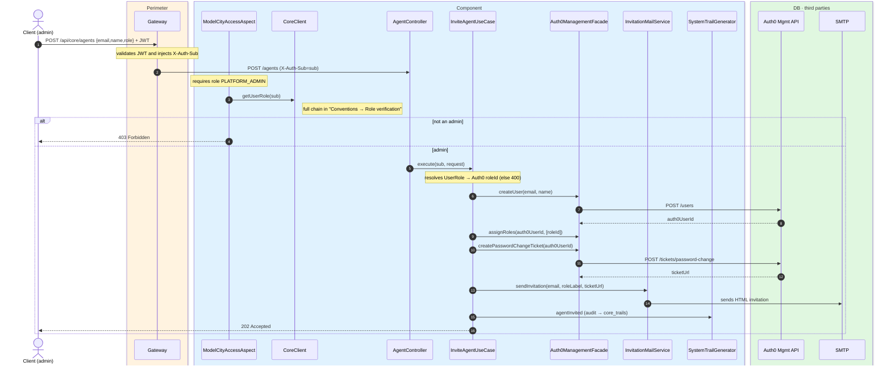
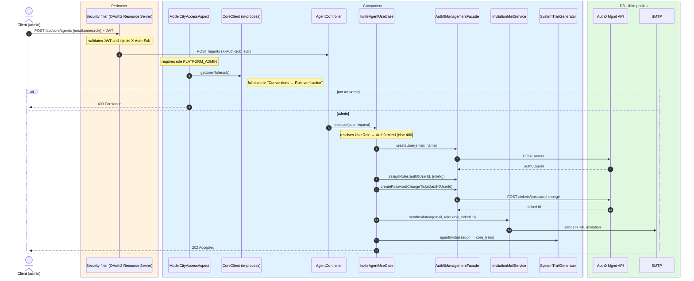

# Invite agent (staff)

`POST /api/core/agents` → `InviteAgentUseCase`

Invites a new city-hall staff member (`BACKOFFICE`, `OPERATOR` or `MOBILITY_AGENT`). **Admin
only** (`PLATFORM_ADMIN`). The use case maps the received `role` to its Auth0 `roleId` (if the
role is not one of the three valid ones → `400`), creates the user in **Auth0**, assigns the
role, generates a **password-change ticket** and emails the invitation with that link. Returns
`202 Accepted` (accepted; the account materializes when the invitee sets their password).

The record in `core`'s database is created later, on the agent's own sign-in (JIT provisioning),
which detects the role already assigned in Auth0. Records the `AGENT_INVITED` audit event.

## Inputs

**`POST /api/core/agents`**

```json
{
  "name": "Marta Ruiz",
  "email": "marta.ruiz@ayto.example.com",
  "role": "MODEL-CITY-BACKOFFICE"
}
```

> `role` must be one of `MODEL-CITY-BACKOFFICE`, `MODEL-CITY-OPERATOR` or
> `MODEL-CITY-MOBILITY-AGENT`.

## Outputs

- **`202 Accepted`** — invitation accepted and email sent (no body).
- **`400 Bad Request`** — invalid `role`.
- **`403 Forbidden`** — the requester is not an admin.

## Sequence — microservices



## Sequence — monolith


