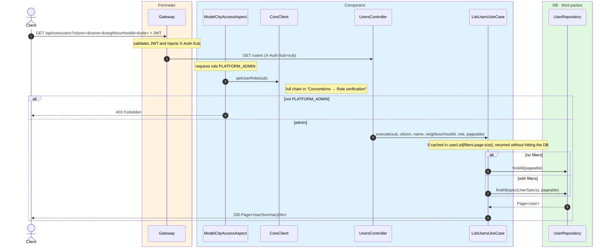
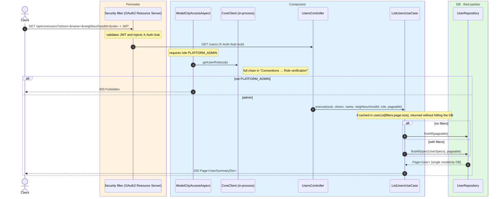

# List users

`GET /api/core/users` → `ListUsersUseCase`

Lists users paginated (20 per page) for the backoffice. **Admin only**: method-level
authorization requires `PLATFORM_ADMIN`, which the `ModelCityAccessAspect` resolves through
`CoreClient` before the method runs; a non-admin gets `403`. Four optional, combinable filters
(via `UserSpecs`): `citizen` (`true` → citizens only, `false` → staff only, absent → all),
`name` (case-insensitive substring), `neighbourhoodId` and `role`.

The result is cached in `userList` keyed by the four filters plus pagination. Returns a `Page`
of `UserSummaryDto` (a lightweight projection with status and neighbourhood).

## Inputs

**`GET /api/core/users?citizen=false&name=&neighbourhoodId=&role=&page=0`** — no body.

| Query param | Type | Notes |
| --- | --- | --- |
| `citizen` | boolean | `true` citizens · `false` staff · omit → all |
| `name` | string | case-insensitive substring on the name |
| `neighbourhoodId` | long | filter citizens by neighbourhood |
| `role` | string | filter staff by role (dash format, e.g. `MODEL-CITY-OPERATOR`) |
| `page` | int | 0-based; page size 20 |

## Outputs

- **`200 OK`** — `Page<UserSummaryDto>`.
- **`403 Forbidden`** — the requester is not an admin.

```json
{
  "content": [
    {
      "id": "auth0|aaa111",
      "name": "Marta Ruiz",
      "email": "marta.ruiz@ayto.example.com",
      "role": "MODEL-CITY-BACKOFFICE",
      "status": "ACTIVE",
      "neighbourhoodId": null,
      "neighbourhoodName": null,
      "createdAt": "2026-03-10T09:00:00Z"
    }
  ],
  "totalElements": 1,
  "totalPages": 1,
  "number": 0,
  "size": 20,
  "first": true,
  "last": true
}
```

## Sequence — microservices



## Sequence — monolith


