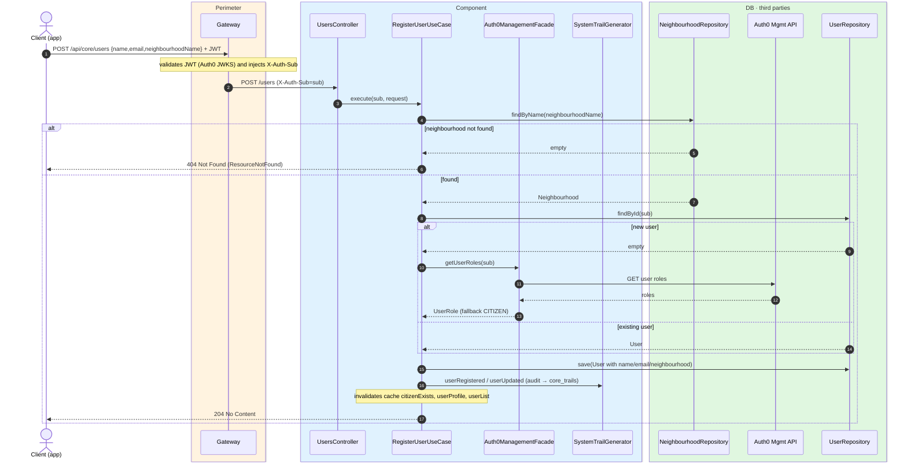
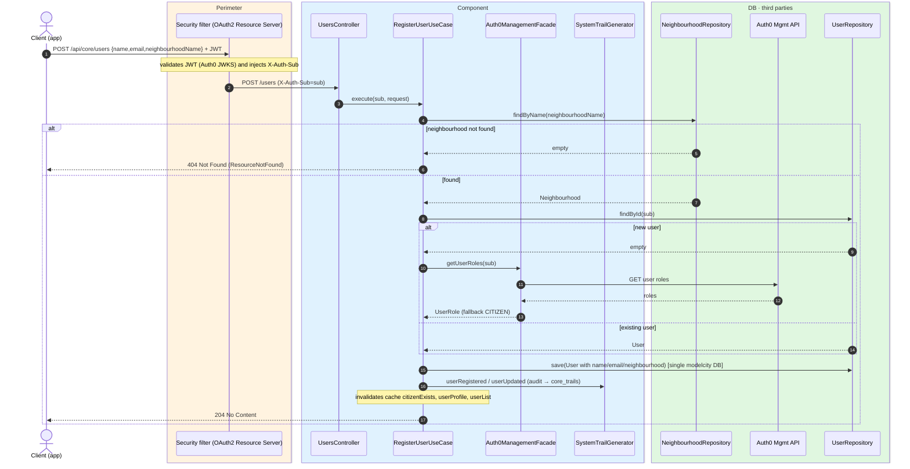

# Sign-in / JIT provisioning

`POST /api/core/users` → `RegisterUserUseCase`

Entry point when a citizen signs in from the app. The user record is **provisioned
just-in-time (JIT)**: the Auth0 `sub` arrives in the `X-Auth-Sub` header and the body supplies
`name`, `email` and `neighbourhoodName` (the neighbourhood's internal kebab-case name). If the
user does not exist yet it is created — its application role is resolved by querying Auth0,
falling back to `MODEL_CITY_CITIZEN` if the lookup fails or no role is assigned — and if it
already exists, its name, email and neighbourhood are refreshed. Returns `204 No Content`.

The neighbourhood is resolved by name against `NeighbourhoodRepository`; if it does not exist,
`404`. The operation is transactional and, on completion, records an audit event
(`USER_REGISTERED` or `USER_UPDATED`) through the `SystemTrailGenerator` and **invalidates** the
`citizenExists`, `userProfile` (key `#sub`) and `userList` caches.

## Inputs

**`POST /api/core/users`**

```json
{
  "name": "Lucía Fernández",
  "email": "lucia.fernandez@example.com",
  "neighbourhoodName": "el-recreo-norte"
}
```

## Outputs

- **`204 No Content`** — no body.
- **`404 Not Found`** — the neighbourhood does not exist (`ApiErrorResponse`).

## Sequence — microservices



## Sequence — monolith


