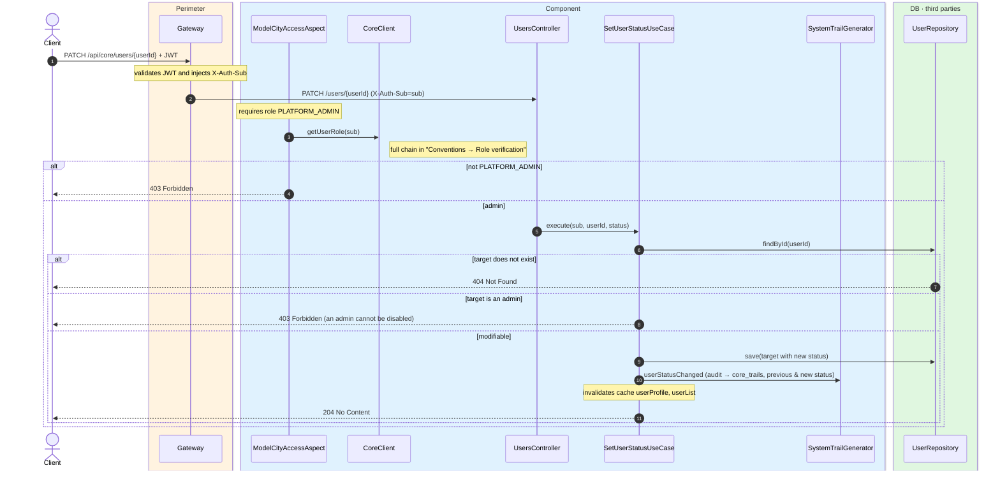
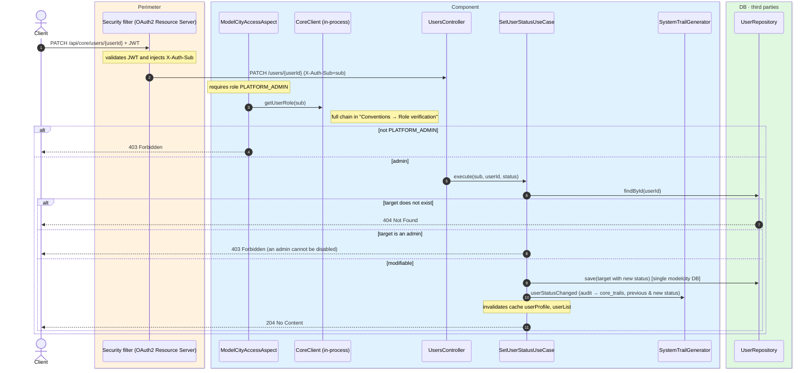

# Enable / disable user

`PATCH /api/core/users/{userId}` → `SetUserStatusUseCase`

Changes a user account's status (`ACTIVE` / `DISABLED`). **Admin only** (`PLATFORM_ADMIN`,
verified by `ModelCityAccessAspect` through `CoreClient`). As a safeguard, **platform admins
cannot be disabled**: if the target is a `PLATFORM_ADMIN`, `403`. If the target does not exist,
`404`. On success, `204 No Content`.

After the change it records a `USER_STATUS_CHANGED` audit event (with the previous and new
status) and invalidates the `userProfile` and `userList` caches.

## Inputs

**`PATCH /api/core/users/{userId}`**

```json
{ "status": "DISABLED" }
```

## Outputs

- **`204 No Content`** — status changed (no body).
- **`403 Forbidden`** — the target is a platform admin.
- **`404 Not Found`** — the target does not exist.

## Sequence — microservices



## Sequence — monolith


