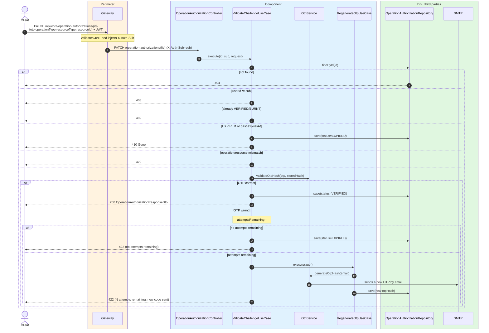
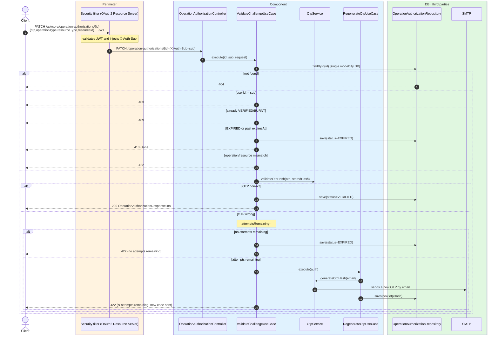

# Validate challenge (verify OTP)

`PATCH /api/core/operation-authorizations/{id}` → `ValidateChallengeUseCase`

Verifies the OTP the citizen received by email and, if correct, moves the authorization to
`VERIFIED` (the state the target domain requires before running the operation). The body repeats
the operation being authorized (`operationType`/`resourceType`/`resourceId`) plus the entered
`otp`; the `sub` arrives via `X-Auth-Sub`. The use case checks, in order: existence (`404`),
ownership by the same user (`403`), that it is not already `VERIFIED`/`BURNT` (`409`), that it
has not expired — if it has, it marks it `EXPIRED` and returns `410` — and that the
operation/resource match (`422`).

If the OTP is **wrong**, it decrements `attemptsRemaining`: when it reaches zero the
authorization becomes `EXPIRED` and returns `422`; if attempts remain, it **regenerates and
resends** a new OTP (`RegenerateOtpUseCase`) and returns `422` indicating the remaining
attempts. The method is transactional but **does not roll back** on `ResponseStatusException`,
so state and attempt changes are persisted **even** when it ends by throwing an HTTP error. On
successful verification it records `OPERATION_AUTHORIZATION_VERIFIED`.

## Inputs

**`PATCH /api/core/operation-authorizations/{id}`**

```json
{
  "otp": "482915",
  "operationType": "CONFIRM_ANSWER",
  "resourceType": "public-question",
  "resourceId": "42"
}
```

## Outputs

- **`200 OK`** — OTP correct, authorization `VERIFIED`.
- **`403`** — the authorization belongs to another user.
- **`409`** — already `VERIFIED`/`BURNT`.
- **`410 Gone`** — expired (2-minute TTL elapsed).
- **`422 Unprocessable Content`** — wrong OTP (a new one is resent if attempts remain), or
  operation/resource mismatch, or no attempts remaining.

```json
{
  "operationAuthorizationId": "8f3a9c1e-2b7d-4e6a-9f12-0a1b2c3d4e5f",
  "operationType": "CONFIRM_ANSWER",
  "resourceType": "public-question",
  "resourceId": "42",
  "userId": "auth0|6627f0a1c2d3e4f5a6b7c8d9",
  "expiresAt": "2026-06-17T10:32:00Z",
  "status": "VERIFIED",
  "attemptsRemaining": 3,
  "createdAt": "2026-06-17T10:30:00Z"
}
```

## Sequence — microservices



## Sequence — monolith


