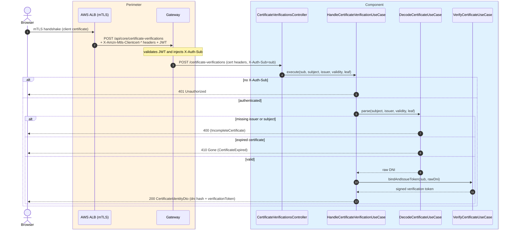
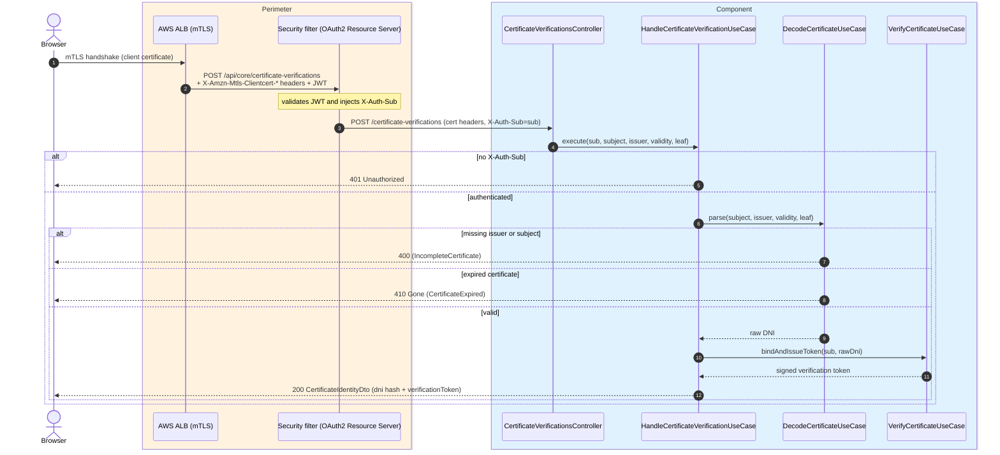

# Verify mTLS certificate (DNIe / electronic certificate)

`POST /api/core/certificate-verifications` → `HandleCertificateVerificationUseCase`
(`DecodeCertificateUseCase` + `VerifyCertificateUseCase`)

Part of the Spanish electronic-identity flow over mTLS: the **AWS ALB** performs the mutual-TLS handshake and
forwards the client certificate in `X-Amzn-Mtls-Clientcert-*` headers. The use case parses and
validates the certificate (issuer, subject, validity), extracts the document number (DNI) from the
subject, binds the **hashed** DNI to the authenticated account and issues a signed
**verification token**. Because it creates a *certificate-verification* resource (persists the DNI
hash and mints a token) it is a **`POST`**, not a `GET`.

The token is the credential later forwarded to
[create challenge](./create-challenge.md) (operation authorization) for DNI-bound operations (e.g.
voting). The response is always plain JSON — the endpoint never redirects.

Certificate errors: missing issuer or subject → `400`; expired certificate → `410 Gone`.
Authentication is required (the gateway must inject `X-Auth-Sub`); otherwise → `401`.

## Inputs

**`POST /api/core/certificate-verifications`** — no request body; the certificate travels in the
`X-Amzn-Mtls-Clientcert-*` headers added by the ALB, and the caller's `Authorization: Bearer <JWT>`
is turned into `X-Auth-Sub` by the gateway.

## Outputs

- **`200 OK`** — `CertificateIdentityDto` (JSON). No redirect.
- **`400 Bad Request`** — incomplete certificate (missing issuer or subject).
- **`401 Unauthorized`** — no authenticated principal (`X-Auth-Sub` missing).
- **`410 Gone`** — certificate expired.

```json
{
  "verificationToken": "eyJ.....",
  "dni": "edcdb39bcd7d186385ad3c4b9532d299"
}
```

## Sequence — microservices



## Sequence — monolith


