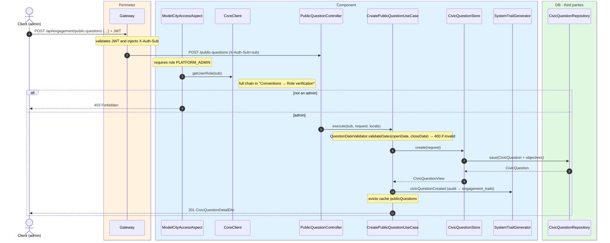
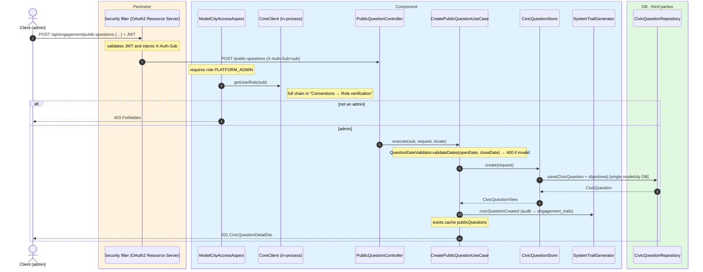

# Create civic question

`POST /api/engagement/public-questions` → `CreatePublicQuestionUseCase`

Creates a new civic question with its objectives. **Admin only**
(`@ModelCityAccess.PlatformAdmin`). The body is validated with `jakarta.validation`
(title/description/objectives maps non-empty, dates, `zoneId`, `neighbourhoodId`). Then
`QuestionDateValidator` enforces that `openDate` is after today and `closeDate` is at least 3
days after `openDate`. Returns `201` with `CivicQuestionDetailDto` (votes at 0 and
`submittable=false`).

The localizable `title`, `description` and each `objective` are `Map<String, String>` with a
mandatory `es` entry; the response is resolved to `Accept-Language`.

Audits `CIVIC_QUESTION_CREATED` and evicts the whole `publicQuestions` cache.

## Inputs

**`POST /api/engagement/public-questions`**

```json
{
  "title": {
    "es": "¿Peatonalizar la calle Mayor?",
    "en": "Should Calle Mayor be pedestrianized?"
  },
  "description": {
    "es": "Propuesta para restringir el tráfico rodado en el tramo central.",
    "en": "Proposal to restrict motor traffic in the central stretch."
  },
  "imageUrl": "https://cdn.modelcity.example/questions/42.jpg",
  "openDate": "2026-07-01",
  "closeDate": "2026-07-20",
  "zoneId": 3,
  "neighbourhoodId": 7,
  "objectives": [
    { "objective": { "es": "Reducir el ruido", "en": "Reduce noise" }, "sortOrder": 0 },
    { "objective": { "es": "Mejorar la seguridad peatonal", "en": "Improve pedestrian safety" }, "sortOrder": 1 }
  ]
}
```

## Outputs

- **`201 Created`** — `CivicQuestionDetailDto`.
- **`400 Bad Request`** — validation error or dates invalid.
- **`403 Forbidden`** — not an admin.

```json
{
  "id": 42,
  "title": "Should Calle Mayor be pedestrianized?",
  "description": "Proposal to restrict motor traffic in the central stretch.",
  "imageUrl": "https://cdn.modelcity.example/questions/42.jpg",
  "openDate": "2026-07-01",
  "closeDate": "2026-07-20",
  "zoneId": 3,
  "neighbourhoodId": 7,
  "objectives": [
    { "id": 100, "objective": "Reduce noise", "sortOrder": 0 },
    { "id": 101, "objective": "Improve pedestrian safety", "sortOrder": 1 }
  ],
  "yesVotes": 0,
  "noVotes": 0,
  "submittable": false
}
```

## Sequence — microservices



## Sequence — monolith


