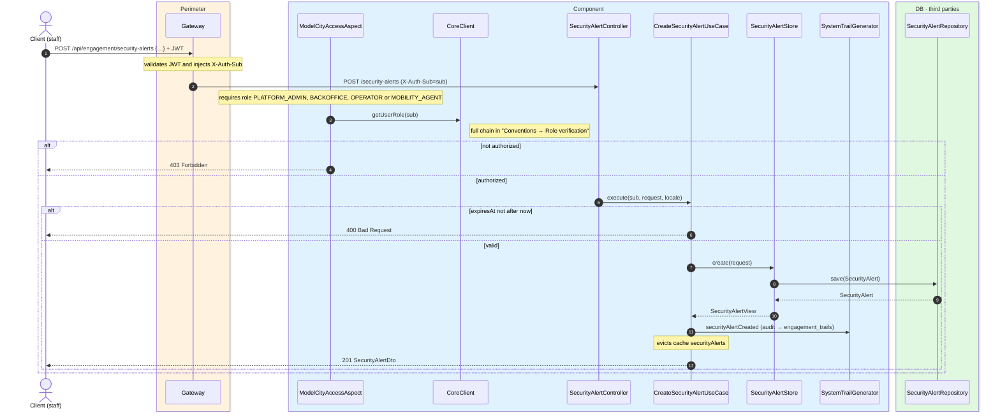
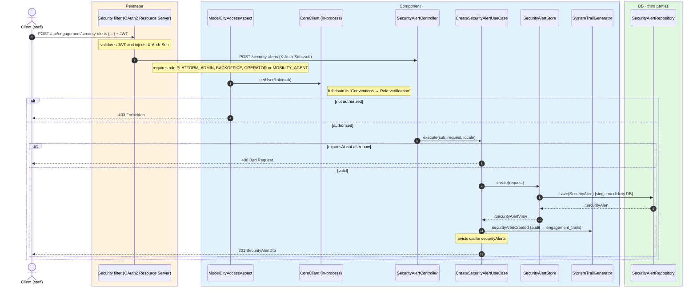

# Create security alert

`POST /api/engagement/security-alerts` → `CreateSecurityAlertUseCase`

Creates a geolocated security alert. Authorized roles: `PLATFORM_ADMIN`, `BACKOFFICE`,
`OPERATOR` or `MOBILITY_AGENT`. The body is validated with `jakarta.validation` and `expiresAt`
must be in the future (`400` otherwise). Returns `201` with `SecurityAlertDto`.

Localizable `title` and `description` are `Map<String, String>` with mandatory `es`; the
response is resolved to `Accept-Language`.

Audits `SECURITY_ALERT_CREATED` and evicts the whole `securityAlerts` cache.

## Inputs

**`POST /api/engagement/security-alerts`**

```json
{
  "title": {
    "es": "Corte de tráfico por obras",
    "en": "Road closure for works"
  },
  "severity": "IMPORTANT",
  "description": {
    "es": "Calle Mayor cortada entre las 8:00 y las 14:00.",
    "en": "Calle Mayor closed between 8:00 and 14:00."
  },
  "latitude": 40.4168,
  "longitude": -3.7038,
  "zoneId": 3,
  "neighbourhoodId": 7,
  "expiresAt": "2026-06-17T14:00:00Z"
}
```

## Outputs

- **`201 Created`** — `SecurityAlertDto`.
- **`400 Bad Request`** — validation error or `expiresAt` not in the future.
- **`403 Forbidden`** — unauthorized role.

```json
{
  "id": 9001,
  "title": "Road closure for works",
  "severity": "IMPORTANT",
  "description": "Calle Mayor closed between 8:00 and 14:00.",
  "latitude": 40.4168,
  "longitude": -3.7038,
  "zoneId": 3,
  "neighbourhoodId": 7,
  "createdAt": "2026-06-17T07:00:00Z",
  "expiresAt": "2026-06-17T14:00:00Z"
}
```

## Sequence — microservices



## Sequence — monolith


