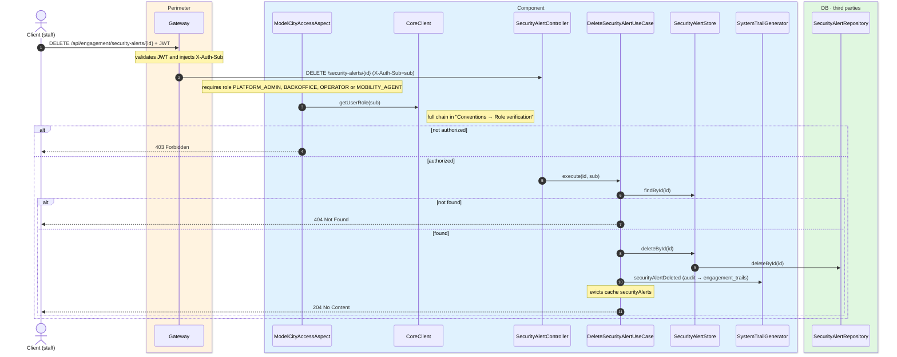
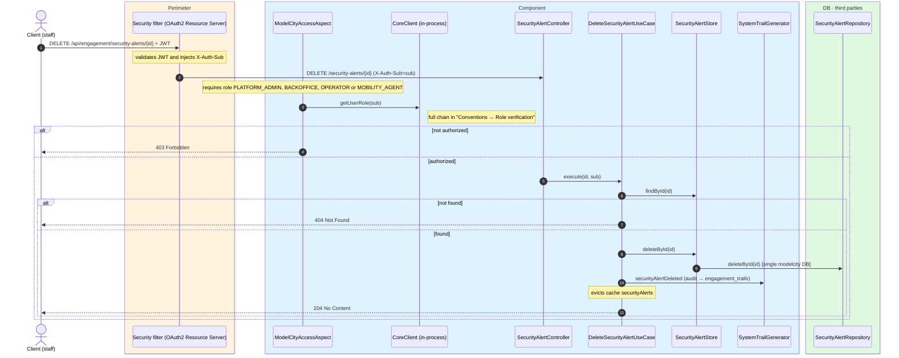

# Delete security alert

`DELETE /api/engagement/security-alerts/{id}` → `DeleteSecurityAlertUseCase`

Deletes a security alert. Authorized roles: `PLATFORM_ADMIN`, `BACKOFFICE`, `OPERATOR` or
`MOBILITY_AGENT`. If the alert does not exist, `404` (`ResourceNotFoundException`). On success,
returns `204 No Content`. Audits `SECURITY_ALERT_DELETED` and evicts the whole `securityAlerts`
cache.

## Inputs

**`DELETE /api/engagement/security-alerts/{id}`** — no body.

## Outputs

- **`204 No Content`** — alert deleted.
- **`403 Forbidden`** — unauthorized role.
- **`404 Not Found`** — alert does not exist.

## Sequence — microservices

## Sequence — monolith

