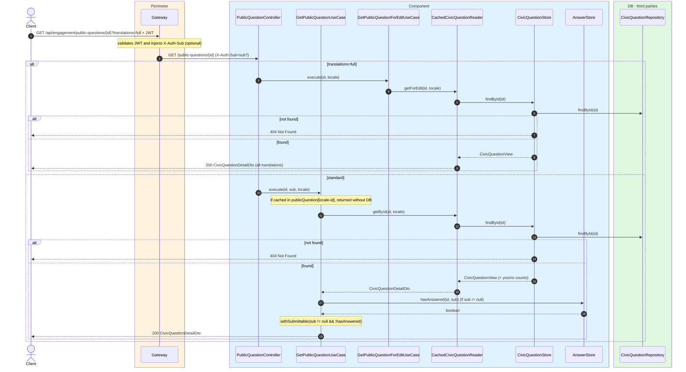
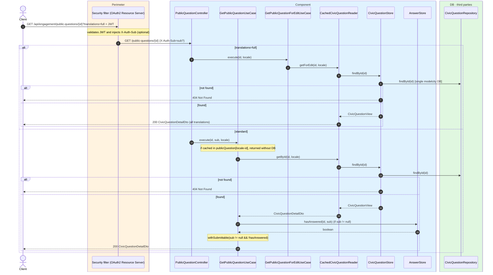

# Civic question detail

`GET /api/engagement/public-questions/{id}` → `GetPublicQuestionUseCase`
`GET /api/engagement/public-questions/{id}?translations=full` → `GetPublicQuestionForEditUseCase`

Returns the full detail of one civic question, including objectives, vote counts
(`yesVotes`/`noVotes`) and the `submittable` flag. `submittable` is `true` only when the
caller sent a `sub` (i.e. `X-Auth-Sub` is present) and that user has not answered the question
yet. If not found, `404`.

The `?translations=full` variant returns every locale of each localizable field (admin
editing). It is not cached and has no `submittable` flag (the value is always `false`).

The standard detail is cached in `publicQuestion` keyed by `locale-id` (the shared part is
user-agnostic; `submittable` is applied per request outside the cache).

## Inputs

**`GET /api/engagement/public-questions/{id}`** — no body.

## Outputs

- **`200 OK`** — `CivicQuestionDetailDto`.
- **`404 Not Found`** — question does not exist.

```json
{
  "id": 42,
  "title": "¿Peatonalizar la calle Mayor?",
  "description": "Propuesta para restringir el tráfico rodado en el tramo central.",
  "imageUrl": "https://cdn.modelcity.example/questions/42.jpg",
  "openDate": "2026-06-10",
  "closeDate": "2026-06-30",
  "zoneId": 3,
  "neighbourhoodId": 7,
  "objectives": [
    { "id": 100, "objective": "Reducir el ruido", "sortOrder": 0 },
    { "id": 101, "objective": "Mejorar la seguridad peatonal", "sortOrder": 1 }
  ],
  "yesVotes": 128,
  "noVotes": 37,
  "submittable": true
}
```

When `translations=full`:

```json
{
  "id": 42,
  "title": "¿Peatonalizar la calle Mayor?",
  "description": "Propuesta para restringir el tráfico rodado en el tramo central.",
  "translations": {
    "title": {
      "es": "¿Peatonalizar la calle Mayor?",
      "en": "Should Calle Mayor be pedestrianized?"
    },
    "description": {
      "es": "Propuesta para restringir el tráfico rodado en el tramo central.",
      "en": "Proposal to restrict motor traffic in the central stretch."
    }
  },
  "yesVotes": 128,
  "noVotes": 37,
  "submittable": false
}
```

## Sequence — microservices



## Sequence — monolith


