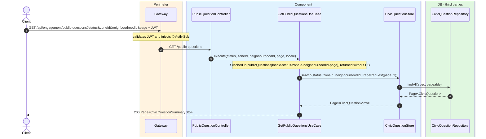
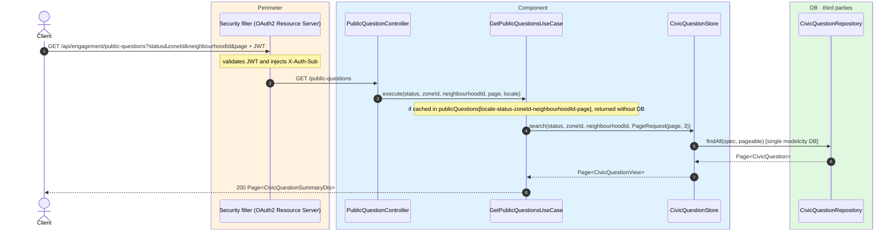

# List civic questions

`GET /api/engagement/public-questions` → `GetPublicQuestionsUseCase`

Returns a paginated list of civic questions. **Any authenticated user**. Optional filters:
`status` (`active`, `past`, `future` or any other string), `zoneId` and `neighbourhoodId`.
Pagination is **3 per page**, base 1? Actually `page` is 0-based (Spring `PageRequest.of(page, 3)`).
Returns `Page<CivicQuestionSummaryDto>` (light projection: title only, no description,
objectives or vote counts).

Content is resolved to the `Accept-Language` locale (default `es`) using the i18n fallback
mechanism.

Cached in `publicQuestions` keyed by `locale-status-zoneId-neighbourhoodId-page`. Writes
(create/update/patch/answer) evict the whole cache.

## Inputs

**`GET /api/engagement/public-questions?status=active&zoneId=3&neighbourhoodId=7&page=0`** — no
body.

## Outputs

- **`200 OK`** — `Page<CivicQuestionSummaryDto>` (page size 3, number starts at 0).

```json
{
  "content": [
    {
      "id": 42,
      "title": "¿Peatonalizar la calle Mayor?",
      "imageUrl": "https://cdn.modelcity.example/questions/42.jpg",
      "openDate": "2026-06-10",
      "closeDate": "2026-06-30",
      "zoneId": 3,
      "neighbourhoodId": 7
    }
  ],
  "totalElements": 1,
  "totalPages": 1,
  "number": 0,
  "size": 3,
  "first": true,
  "last": true
}
```

## Sequence — microservices



## Sequence — monolith


