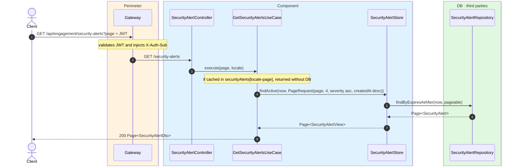
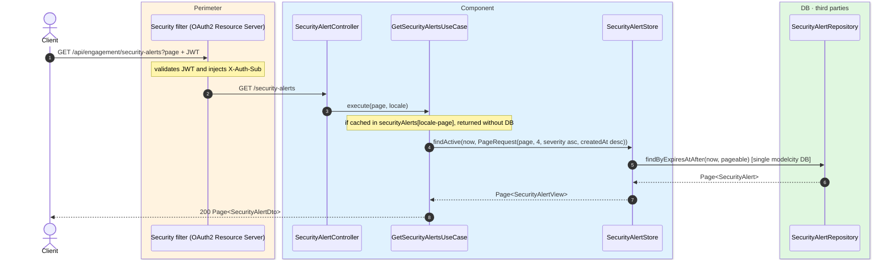

# List active security alerts

`GET /api/engagement/security-alerts` → `GetSecurityAlertsUseCase`

Returns paginated active (non-expired) security alerts. **Any authenticated user**. Page size
is **4**, sorted by `severity` ascending then `createdAt` descending. Cached in `securityAlerts`
keyed by `locale-page`.

Content is resolved to `Accept-Language`.

## Inputs

**`GET /api/engagement/security-alerts?page=0`** — no body.

## Outputs

- **`200 OK`** — `Page<SecurityAlertDto>`.

```json
{
  "content": [
    {
      "id": 9001,
      "title": "Road closure for works",
      "severity": "IMPORTANT",
      "description": "Calle Mayor closed between 8:00 and 14:00.",
      "latitude": 40.4168,
      "longitude": -3.7038,
      "zoneId": 3,
      "neighbourhoodId": 7,
      "createdAt": "2026-06-17T07:00:00Z",
      "expiresAt": "2026-06-17T14:00:00Z"
    }
  ],
  "totalElements": 1,
  "totalPages": 1,
  "number": 0,
  "size": 4,
  "first": true,
  "last": true
}
```

`severity` can be `IMPORTANT`, `MEDIUM` or `MILD`.

## Sequence — microservices



## Sequence — monolith


