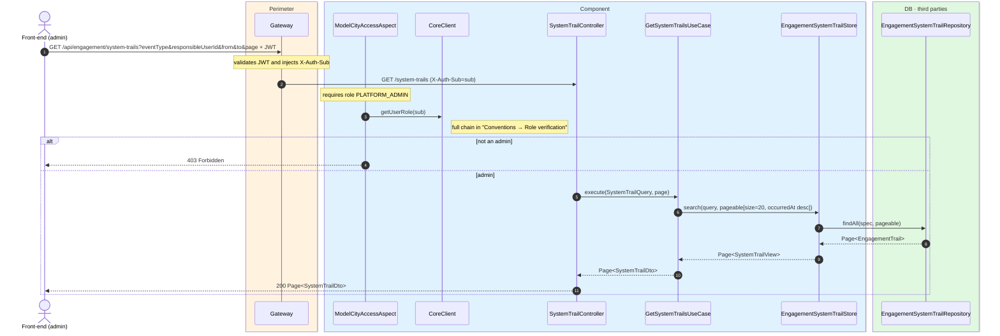
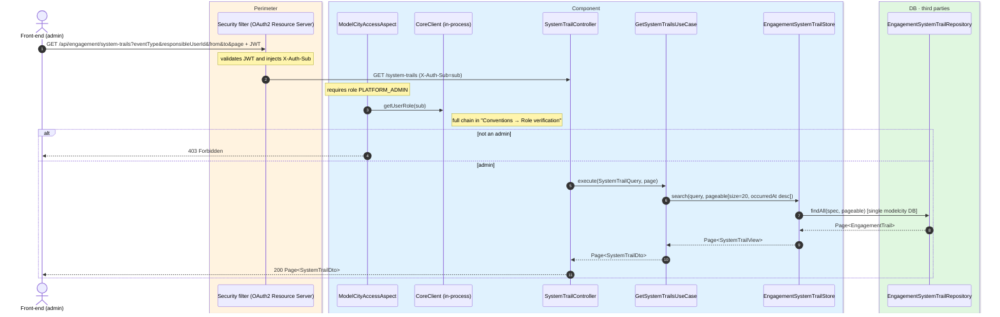

# Query the audit log (engagement)

`GET /api/engagement/system-trails` → `GetSystemTrailsUseCase`

**Admin-only** (`PLATFORM_ADMIN`) read of the engagement vertical's audit log. Returns 20 events
per page ordered by `occurredAt` descending. Filters: `eventType`, `responsibleUserId`, `from`,
`to`, `page`.

Writes are automatic: `CreatePublicQuestionUseCase`, `UpdatePublicQuestionUseCase`,
`PatchPublicQuestionUseCase`, `SubmitAnswerUseCase`, `CreateSecurityAlertUseCase` and
`DeleteSecurityAlertUseCase` call `SystemTrailGenerator` (`com.modelcity.engagement.trails`),
which persists via `EngagementSystemTrailStore` into `engagement_trails`.

Vertical event types: `CIVIC_QUESTION_CREATED`, `CIVIC_QUESTION_UPDATED`, `ANSWER_SUBMITTED`,
`SECURITY_ALERT_CREATED`, `SECURITY_ALERT_DELETED`.

## Inputs

**`GET /api/engagement/system-trails?eventType=ANSWER_SUBMITTED&page=0`** — no body.

## Outputs

- **`200 OK`** — `Page<SystemTrailDto>` (20 per page, `occurredAt` descending).
- **`403 Forbidden`** — requester is not an admin.

```json
{
  "content": [
    {
      "eventId": "d4e5f6a7-2222-3333-4444-555566667777",
      "eventType": "ANSWER_SUBMITTED",
      "operationType": "CREATE",
      "occurredAt": "2026-06-17T10:30:00Z",
      "responsibleUserId": "auth0|abc",
      "responsibleUserRole": "MODEL-CITY-CITIZEN",
      "resourceType": "CIVIC_ANSWER",
      "resourceId": "5012",
      "payload": {
        "answerId": 5012,
        "questionId": 42,
        "citizenSub": "auth0|abc",
        "vote": "YES"
      }
    }
  ],
  "totalElements": 1,
  "totalPages": 1,
  "number": 0,
  "size": 20
}
```

## Sequence — microservices



## Sequence — monolith


