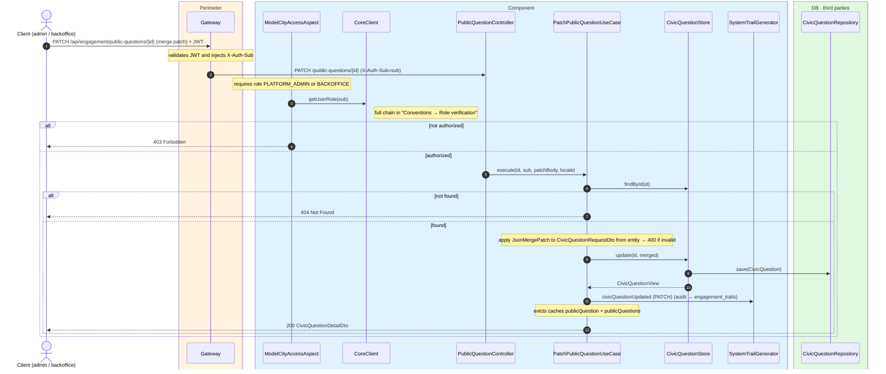
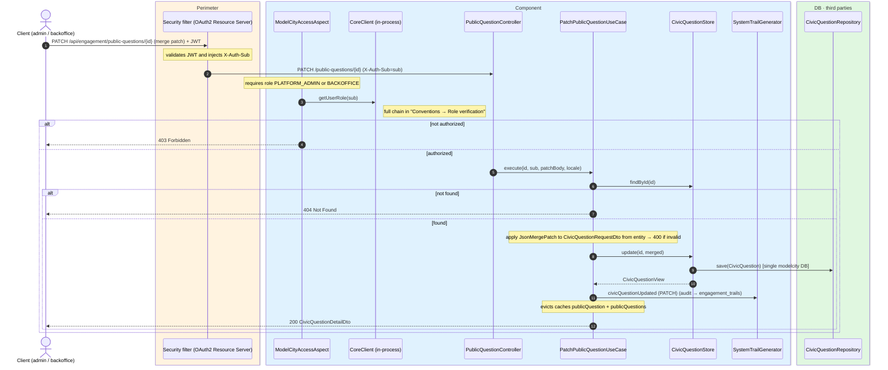

# Patch civic question (JSON Merge Patch)

`PATCH /api/engagement/public-questions/{id}` → `PatchPublicQuestionUseCase`

Partially updates a civic question with a JSON Merge Patch body
(`Content-Type: application/json`). **Admin or backoffice**. The current entity is serialized
into a `CivicQuestionRequestDto` and the patch is applied; an invalid patch returns `400`. If
the question does not exist, `404`.

Contrary to `PUT`, the patch does **not** require the question to be future-dated. Returns `200`
with the updated detail. Audits `CIVIC_QUESTION_UPDATED` with `updateType=PATCH` and evicts
`publicQuestion` + `publicQuestions`.

## Inputs

**`PATCH /api/engagement/public-questions/{id}`**

```json
{
  "title": {
    "es": "¿Peatonalizar la calle Mayor? (texto corregido)",
    "en": "Should Calle Mayor be pedestrianized? (corrected)"
  },
  "closeDate": "2026-07-05"
}
```

## Outputs

- **`200 OK`** — `CivicQuestionDetailDto` with merged fields.
- **`400 Bad Request`** — invalid merge patch or validation error.
- **`403 Forbidden`** — unauthorized role.
- **`404 Not Found`** — question does not exist.

## Sequence — microservices



## Sequence — monolith


