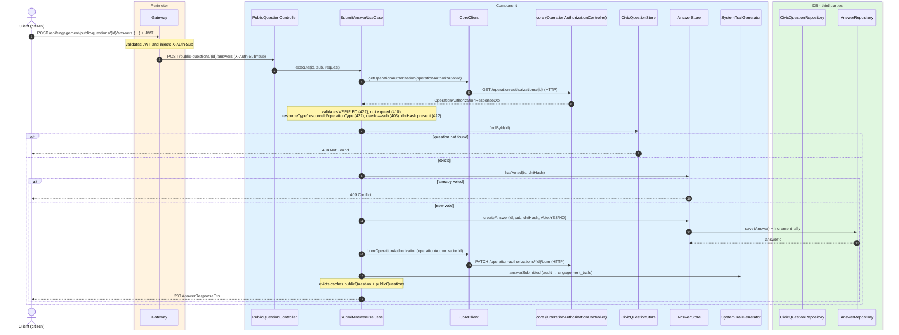
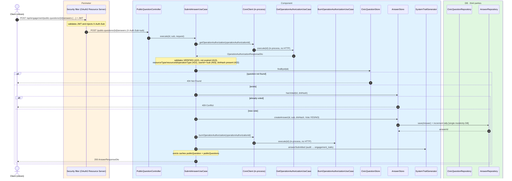

# Submit answer

`POST /api/engagement/public-questions/{id}/answers` → `SubmitAnswerUseCase`

Registers a citizen's YES/NO vote. This is the only engagement operation that calls `core`:
it validates and burns an `operation-authorization` created by `core`.

The body contains `operationAuthorizationId` (UUID) and `vote` (`YES` or `NO`). The `sub` comes
from `X-Auth-Sub`. The use case:

1. Fetches the authorization with `CoreClient.getOperationAuthorization`.
2. Validates that it is `VERIFIED`, not expired, `resourceType` = `public-question`,
   `resourceId` = `{id}`, `userId` = `sub` and `operationType` = `CONFIRM_ANSWER`.
3. Verifies the question exists (`404` if not).
4. Deduplicates by `dniHash` from the authorization (the `(question_id, dni_hash)` unique
   constraint is the authoritative backstop). `409` if already voted.
5. Persists the answer and increments the vote tally.
6. Burns the authorization with `CoreClient.burnOperationAuthorization`.

Returns `200` with `answerId`. Transactional. Audits `ANSWER_SUBMITTED` and evicts
`publicQuestion` + `publicQuestions`.

## Inputs

**`POST /api/engagement/public-questions/{id}/answers`**

```json
{
  "operationAuthorizationId": "8f3a9c1e-2b7d-4e6a-9f12-0a1b2c3d4e5f",
  "vote": "YES"
}
```

## Outputs

- **`200 OK`** — `AnswerResponseDto`.
- **`400 Bad Request`** — `vote` not `YES`/`NO`.
- **`403 Forbidden`** — authorization belongs to another user.
- **`404 Not Found`** — question not found.
- **`409 Conflict`** — this DNI already voted on this question.
- **`410 Gone`** — authorization expired.
- **`422 Unprocessable Content`** — authorization not `VERIFIED` or resource/operation mismatch,
  or no `dniHash` (certificate not verified).

```json
{
  "answerId": 5012
}
```

## Sequence — microservices



## Sequence — monolith


