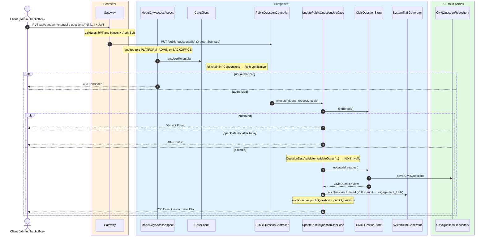
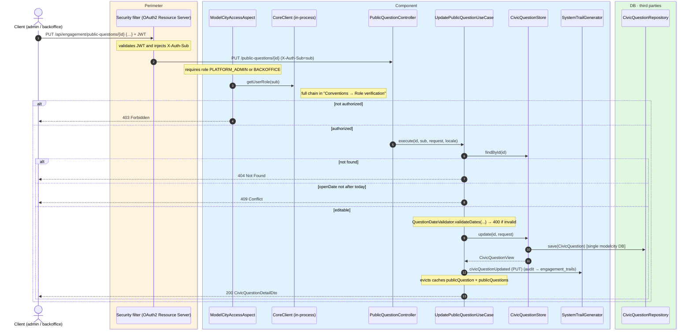

# Replace civic question (PUT)

`PUT /api/engagement/public-questions/{id}` → `UpdatePublicQuestionUseCase`

Fully replaces an existing civic question. **Admin or backoffice**. Only questions whose
`openDate` is still in the future can be updated (`409` otherwise). If the question does not
exist, `404`. The body is a complete replacement, same shape as creation, and the dates are
validated by `QuestionDateValidator`.

Returns `200` with the updated detail. Audits `CIVIC_QUESTION_UPDATED` with `updateType=PUT`
and evicts `publicQuestion` + `publicQuestions` caches.

## Inputs

**`PUT /api/engagement/public-questions/{id}`**

(Same body as `POST /api/engagement/public-questions`.)

```json
{
  "title": {
    "es": "¿Peatonalizar la calle Mayor (tramo norte)?",
    "en": "Should Calle Mayor be pedestrianized (north stretch)?"
  },
  "description": {
    "es": "Versión revisada de la propuesta.",
    "en": "Revised proposal."
  },
  "imageUrl": "https://cdn.modelcity.example/questions/42.jpg",
  "openDate": "2026-07-01",
  "closeDate": "2026-07-20",
  "zoneId": 3,
  "neighbourhoodId": 7,
  "objectives": [
    { "objective": { "es": "Reducir el ruido", "en": "Reduce noise" }, "sortOrder": 0 }
  ]
}
```

## Outputs

- **`200 OK`** — `CivicQuestionDetailDto`.
- **`400 Bad Request`** — validation or date rules violated.
- **`403 Forbidden`** — unauthorized role.
- **`404 Not Found`** — question does not exist.
- **`409 Conflict`** — question is not future-dated.

```json
{
  "id": 42,
  "title": "Should Calle Mayor be pedestrianized (north stretch)?",
  "description": "Revised proposal.",
  "openDate": "2026-07-01",
  "closeDate": "2026-07-20",
  "zoneId": 3,
  "neighbourhoodId": 7,
  "objectives": [
    { "id": 102, "objective": "Reduce noise", "sortOrder": 0 }
  ],
  "yesVotes": 0,
  "noVotes": 0,
  "submittable": false
}
```

## Sequence — microservices



## Sequence — monolith


