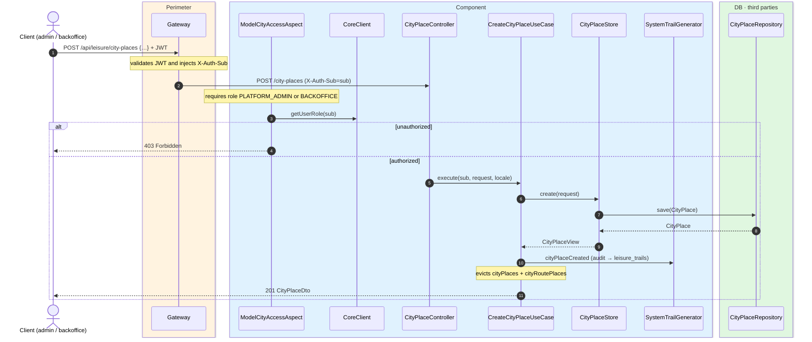
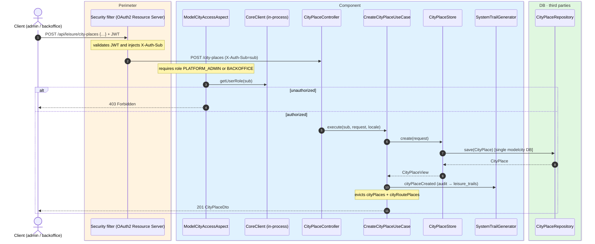

# Create city place

`POST /api/leisure/city-places` → `CreateCityPlaceUseCase`

Creates a new point of interest. **Admin or backoffice**. The request is validated with
`jakarta.validation`: `name` and `description` are non-empty maps with mandatory `es`,
`latitude`/`longitude` are required, and `photoUrls` has at most 3 entries.

Returns `201` with `CityPlaceDto`. Audits `CITY_PLACE_CREATED` and evicts `cityPlaces` and
`cityRoutePlaces`.

## Inputs

**`POST /api/leisure/city-places`**

```json
{
  "name": {
    "es": "Museo Reina Sofía",
    "en": "Reina Sofía Museum"
  },
  "latitude": 40.4087,
  "longitude": -3.6945,
  "description": {
    "es": "Museo nacional de arte del siglo XX.",
    "en": "National museum of 20th-century art."
  },
  "address": {
    "es": "Calle de Santa Isabel, 52",
    "en": "52 Calle de Santa Isabel"
  },
  "photoUrls": [
    "https://cdn.modelcity.example/places/reina-sofia-1.jpg",
    "https://cdn.modelcity.example/places/reina-sofia-2.jpg"
  ],
  "accessInfo": {
    "es": "Metro Atocha",
    "en": "Atocha Metro"
  },
  "accessibilityInfo": {
    "es": "Acceso sin barreras",
    "en": "Step-free access"
  },
  "category": "MUSEUM",
  "visitDurationMinutes": 120
}
```

## Outputs

- **`201 Created`** — `CityPlaceDto`.
- **`400 Bad Request`** — validation error.
- **`403 Forbidden`** — not admin or backoffice.

## Sequence — microservices



## Sequence — monolith


