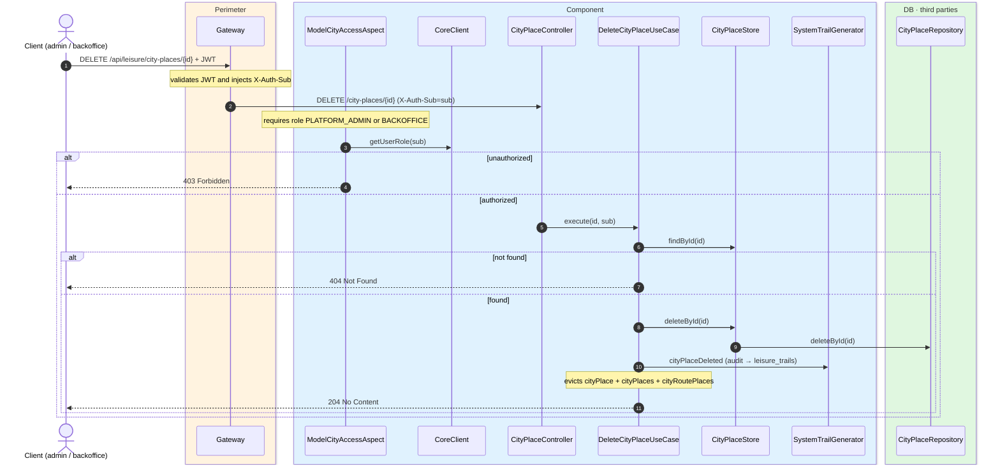
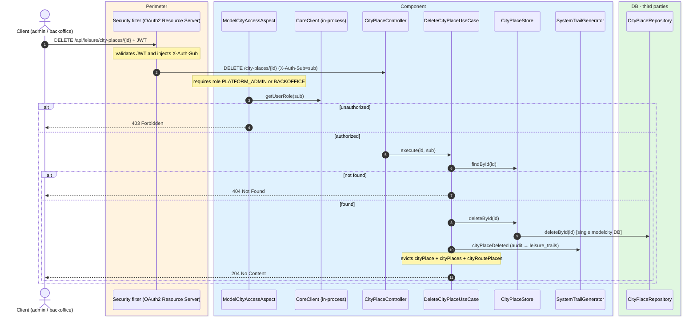

# Delete city place

`DELETE /api/leisure/city-places/{id}` → `DeleteCityPlaceUseCase`

Deletes a city place. **Admin or backoffice**. If not found, `404`. On success, returns
`204 No Content`.

Audits `CITY_PLACE_DELETED` and evicts `cityPlace`, `cityPlaces` and `cityRoutePlaces`.

## Inputs

**`DELETE /api/leisure/city-places/{id}`** — no body.

## Outputs

- **`204 No Content`** — city place deleted.
- **`403 Forbidden`** — not admin or backoffice.
- **`404 Not Found`** — city place not found.

## Sequence — microservices

## Sequence — monolith

