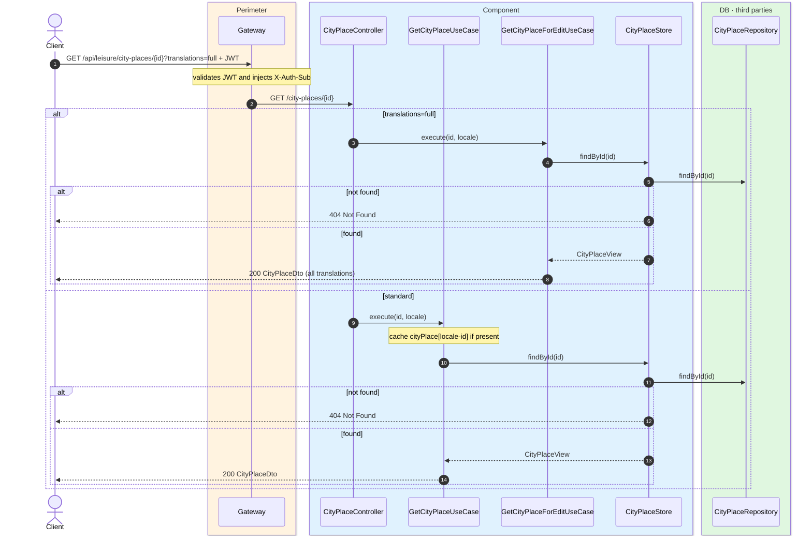
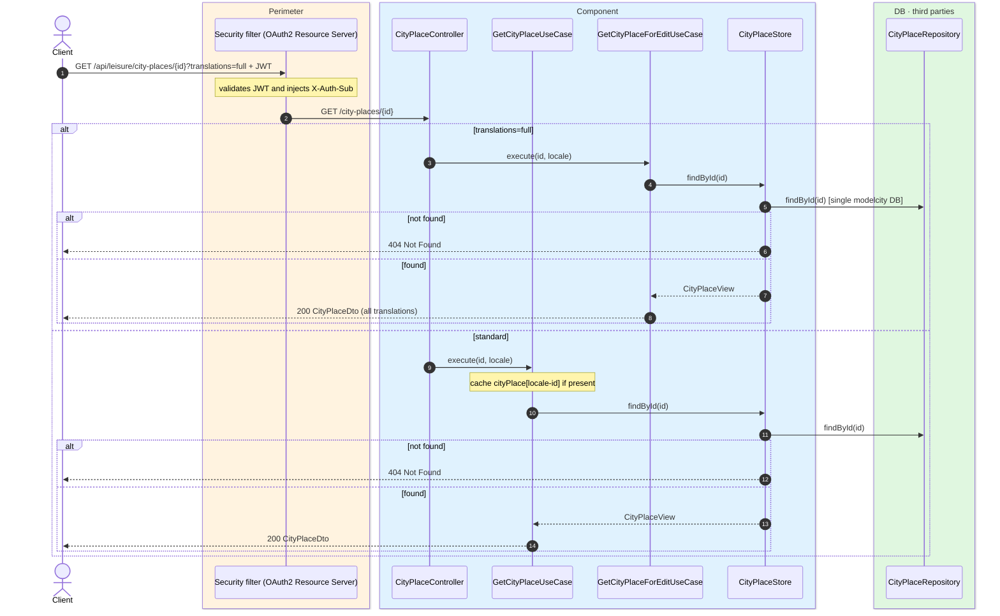

# City place detail

`GET /api/leisure/city-places/{id}` → `GetCityPlaceUseCase`
`GET /api/leisure/city-places/{id}?translations=full` → `GetCityPlaceForEditUseCase`

Returns the full detail of a city place. **Any authenticated user**. If not found, `404`.

The `?translations=full` variant returns every locale for each localizable field
(admin editing). Localizable fields: `name`, `description`, `address`, `accessInfo`,
`accessibilityInfo`.

The standard detail is cached in `cityPlace` keyed by `locale-id`; the full-translations
variant is not cached.

## Inputs

**`GET /api/leisure/city-places/{id}`** — no body.

## Outputs

- **`200 OK`** — `CityPlaceDto`.
- **`404 Not Found`** — city place not found.

```json
{
  "id": 10,
  "name": "Reina Sofía Museum",
  "latitude": 40.4087,
  "longitude": -3.6945,
  "description": "National museum of 20th-century art.",
  "address": "Calle de Santa Isabel, 52",
  "photoUrls": [
    "https://cdn.modelcity.example/places/reina-sofia-1.jpg",
    "https://cdn.modelcity.example/places/reina-sofia-2.jpg"
  ],
  "accessInfo": "Metro Atocha",
  "accessibilityInfo": "Step-free access",
  "category": "MUSEUM",
  "visitDurationMinutes": 120
}
```

`translations=full` example (truncated):

```json
{
  "id": 10,
  "name": "Reina Sofía Museum",
  "description": "National museum of 20th-century art.",
  "translations": {
    "name": {
      "es": "Museo Reina Sofía",
      "en": "Reina Sofía Museum"
    },
    "description": {
      "es": "Museo nacional de arte del siglo XX.",
      "en": "National museum of 20th-century art."
    }
  }
}
```

## Sequence — microservices



## Sequence — monolith


