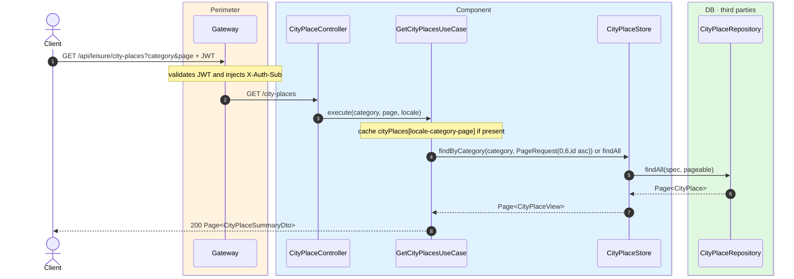
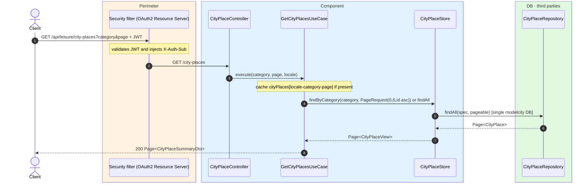

# List city places

`GET /api/leisure/city-places` → `GetCityPlacesUseCase`

Returns paginated city places. **Any authenticated user**. Optional filter by `category`.
Page size is **6**, sorted by `id` ascending. Cached in `cityPlaces` keyed by
`locale-category-page`. Writes to city places evict this cache (and `cityRoutePlaces`).

## Inputs

**`GET /api/leisure/city-places?category=MUSEUM&page=0`** — no body.

## Outputs

- **`200 OK`** — `Page<CityPlaceSummaryDto>`.

```json
{
  "content": [
    {
      "id": 10,
      "name": "Reina Sofía Museum",
      "latitude": 40.4087,
      "longitude": -3.6945,
      "category": "MUSEUM",
      "coverPhotoUrl": "https://cdn.modelcity.example/places/reina-sofia-1.jpg"
    }
  ],
  "totalElements": 1,
  "totalPages": 1,
  "number": 0,
  "size": 6
}
```

## Sequence — microservices



## Sequence — monolith


