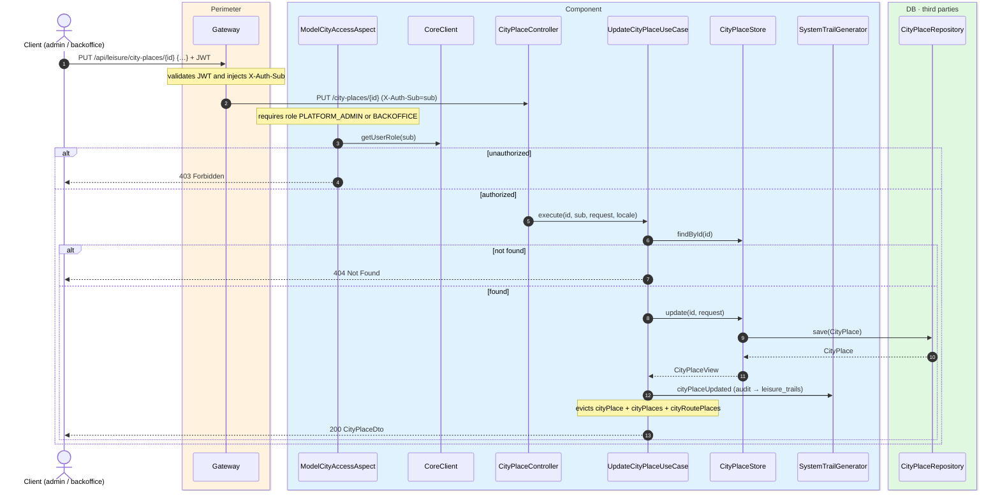
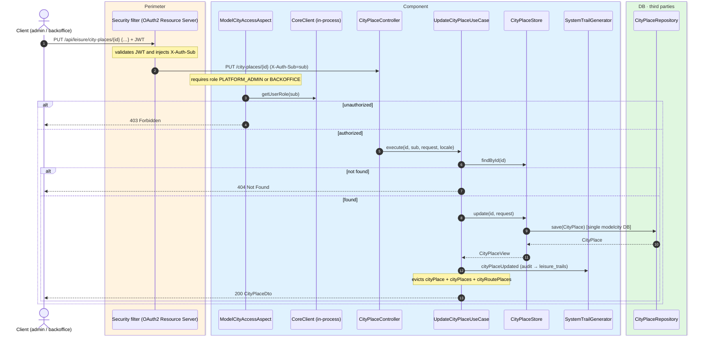

# Replace city place

`PUT /api/leisure/city-places/{id}` → `UpdateCityPlaceUseCase`

Fully replaces an existing city place. **Admin or backoffice**. If the city place does not
exist, `404`. Returns `200` with `CityPlaceDto`.

Audits `CITY_PLACE_UPDATED` and evicts `cityPlace`, `cityPlaces` and `cityRoutePlaces`.

## Inputs

**`PUT /api/leisure/city-places/{id}`** — same body as `POST /api/leisure/city-places`.

## Outputs

- **`200 OK`** — `CityPlaceDto`.
- **`400 Bad Request`** — validation error.
- **`403 Forbidden`** — not admin or backoffice.
- **`404 Not Found`** — city place not found.

## Sequence — microservices

## Sequence — monolith

