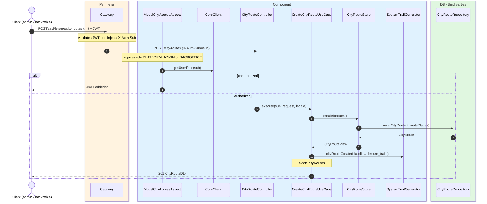
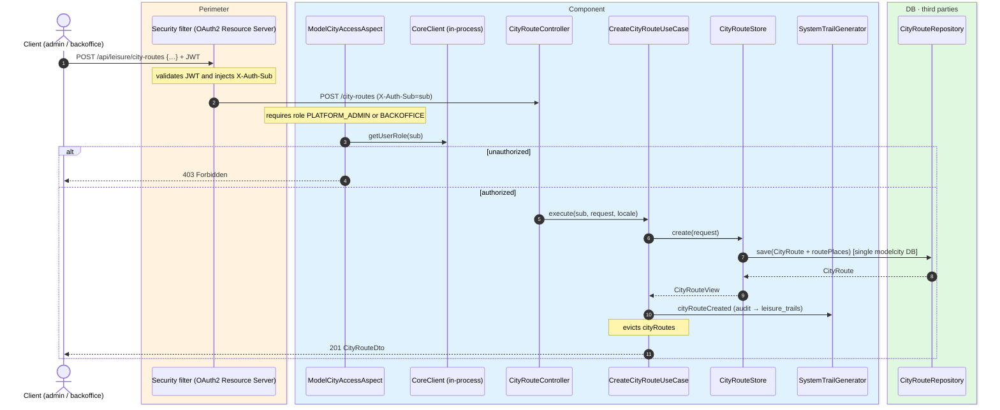

# Create city route

`POST /api/leisure/city-routes` → `CreateCityRouteUseCase`

Creates a new city route with an ordered list of city places. **Admin or backoffice**.
`name`, `description`, `targetAudience` and `cityPlaceIds` are required. Returns `201` with
`CityRouteDto`.

Audits `CITY_ROUTE_CREATED` and evicts `cityRoutes`.

## Inputs

**`POST /api/leisure/city-routes`**

```json
{
  "name": {
    "es": "Ruta del arte",
    "en": "Art route"
  },
  "description": {
    "es": "Paseo por los principales museos y galerías.",
    "en": "A walk through the city's main museums and galleries."
  },
  "targetAudience": "FAMILIES",
  "imageUrl": "https://cdn.modelcity.example/routes/art.jpg",
  "estimatedDurationMinutes": 180,
  "cityPlaceIds": [10, 11]
}
```

## Outputs

- **`201 Created`** — `CityRouteDto` (with resolved places).
- **`400 Bad Request`** — validation error or any `cityPlaceIds` not found (store-dependent).
- **`403 Forbidden`** — not admin or backoffice.

## Sequence — microservices



## Sequence — monolith


