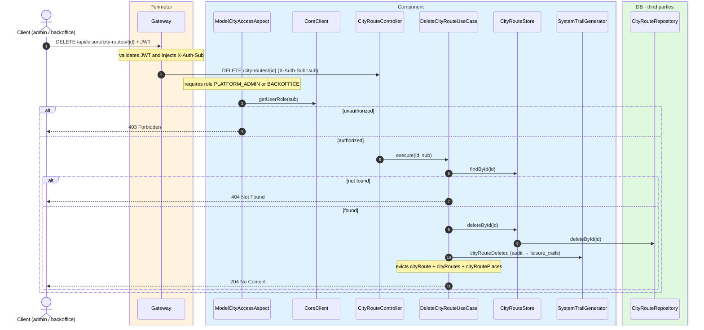
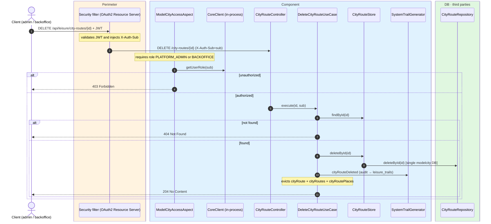

# Delete city route

`DELETE /api/leisure/city-routes/{id}` → `DeleteCityRouteUseCase`

Deletes a city route. **Admin or backoffice**. If not found, `404`. On success, returns
`204 No Content`.

Audits `CITY_ROUTE_DELETED` and evicts `cityRoute`, `cityRoutes` and `cityRoutePlaces`.

## Inputs

**`DELETE /api/leisure/city-routes/{id}`** — no body.

## Outputs

- **`204 No Content`** — route deleted.
- **`403 Forbidden`** — not admin or backoffice.
- **`404 Not Found`** — route not found.

## Sequence — microservices

## Sequence — monolith

