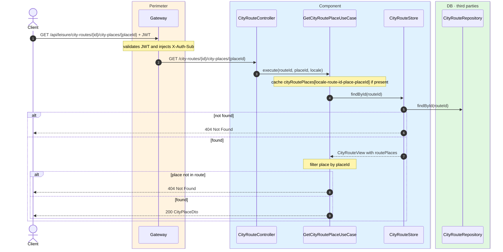
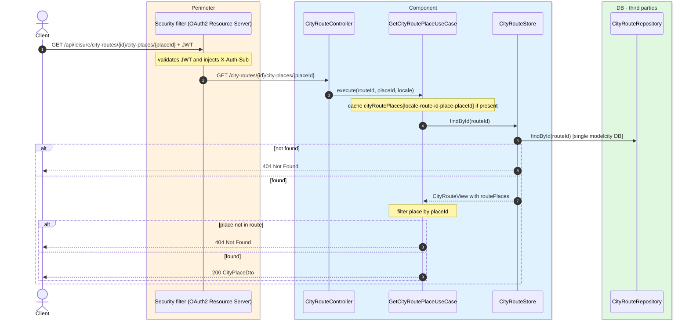

# Place detail inside a city route

`GET /api/leisure/city-routes/{id}/city-places/{placeId}` → `GetCityRoutePlaceUseCase`

Returns the full `CityPlaceDto` for a place that belongs to a route. **Any authenticated user**.
If the route or the place is not found, `404`.

Cached in `cityRoutePlaces` keyed by `locale-route-{routeId}-place-{placeId}`.

## Inputs

**`GET /api/leisure/city-routes/{id}/city-places/{placeId}`** — no body.

## Outputs

- **`200 OK`** — `CityPlaceDto`.
- **`404 Not Found`** — route or place not found.

```json
{
  "id": 10,
  "name": "Reina Sofía Museum",
  "latitude": 40.4087,
  "longitude": -3.6945,
  "description": "National museum of 20th-century art.",
  "address": "Calle de Santa Isabel, 52",
  "photoUrls": [
    "https://cdn.modelcity.example/places/reina-sofia-1.jpg",
    "https://cdn.modelcity.example/places/reina-sofia-2.jpg"
  ],
  "accessInfo": "Metro Atocha",
  "accessibilityInfo": "Step-free access",
  "category": "MUSEUM",
  "visitDurationMinutes": 120
}
```

## Sequence — microservices



## Sequence — monolith


