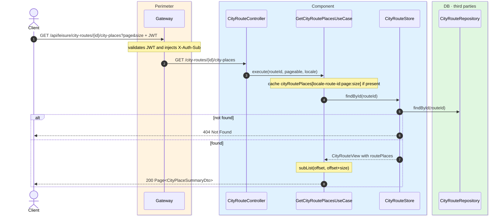
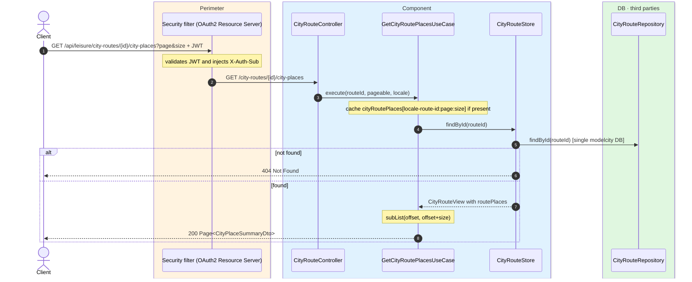

# List places in a city route

`GET /api/leisure/city-routes/{id}/city-places` → `GetCityRoutePlacesUseCase`

Returns the ordered list of city places belonging to a route. **Any authenticated user**.
Default page size is **10** but the controller accepts any `Pageable` (`page`, `size`, `sort`).
Cached in `cityRoutePlaces` keyed by
`locale-route-{routeId}:{pageNumber}:{pageSize}`.

If the route does not exist, `404`.

## Inputs

**`GET /api/leisure/city-routes/{id}/city-places?page=0&size=10`** — no body.

## Outputs

- **`200 OK`** — `Page<CityPlaceSummaryDto>`.
- **`404 Not Found`** — route not found.

```json
{
  "content": [
    {
      "id": 10,
      "name": "Reina Sofía Museum",
      "latitude": 40.4087,
      "longitude": -3.6945,
      "category": "MUSEUM",
      "coverPhotoUrl": "https://cdn.modelcity.example/places/reina-sofia-1.jpg"
    }
  ],
  "totalElements": 2,
  "totalPages": 1,
  "number": 0,
  "size": 10
}
```

## Sequence — microservices



## Sequence — monolith


