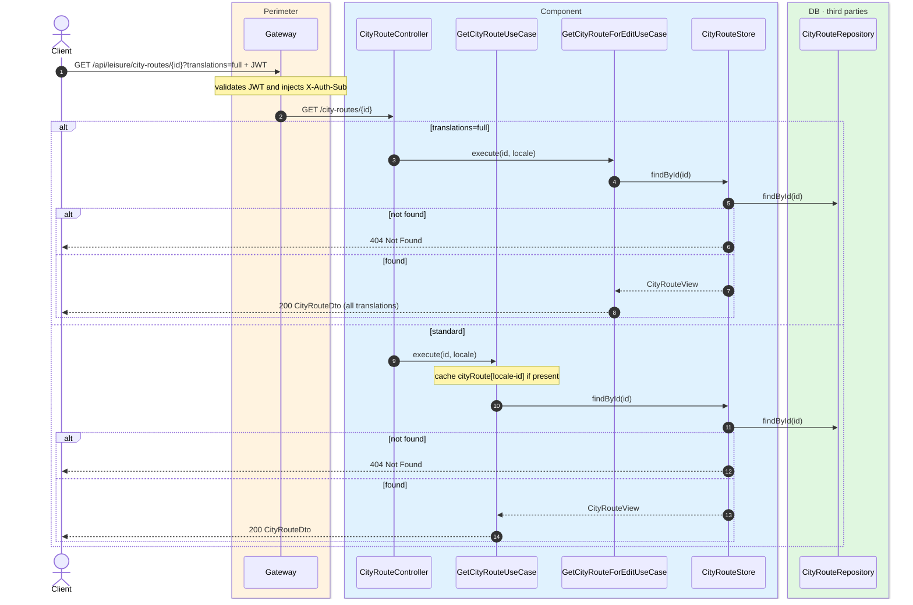
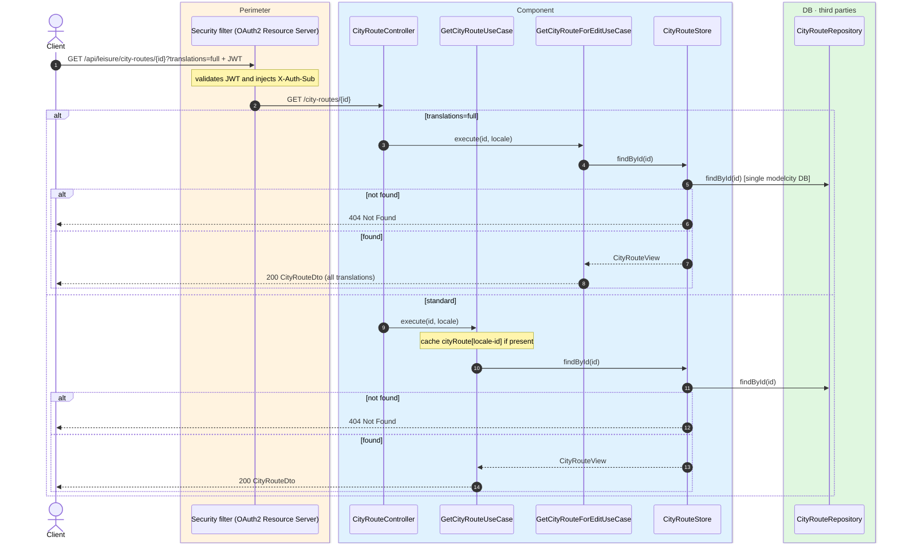

# City route detail

`GET /api/leisure/city-routes/{id}` → `GetCityRouteUseCase`
`GET /api/leisure/city-routes/{id}?translations=full` → `GetCityRouteForEditUseCase`

Returns a city route with its ordered list of places (summaries). **Any authenticated user**.
If not found, `404`.

`?translations=full` returns every locale of `name` and `description` (admin editing) and is
not cached.

Standard detail is cached in `cityRoute` keyed by `locale-id`.

## Inputs

**`GET /api/leisure/city-routes/{id}`** — no body.

## Outputs

- **`200 OK`** — `CityRouteDto`.
- **`404 Not Found`** — route not found.

```json
{
  "id": 100,
  "name": "Art route",
  "description": "A walk through the city's main museums and galleries.",
  "targetAudience": "FAMILIES",
  "imageUrl": "https://cdn.modelcity.example/routes/art.jpg",
  "estimatedDurationMinutes": 180,
  "placeCount": 2,
  "cityPlaces": [
    {
      "id": 10,
      "name": "Reina Sofía Museum",
      "latitude": 40.4087,
      "longitude": -3.6945,
      "category": "MUSEUM",
      "coverPhotoUrl": "https://cdn.modelcity.example/places/reina-sofia-1.jpg"
    },
    {
      "id": 11,
      "name": "Thyssen-Bornemisza",
      "latitude": 40.4163,
      "longitude": -3.6942,
      "category": "MUSEUM",
      "coverPhotoUrl": "https://cdn.modelcity.example/places/thyssen-1.jpg"
    }
  ]
}
```

## Sequence — microservices



## Sequence — monolith


