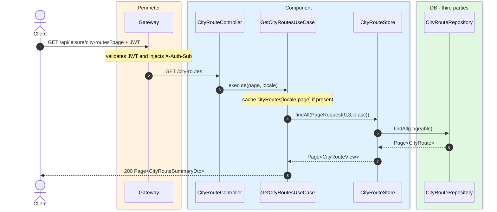
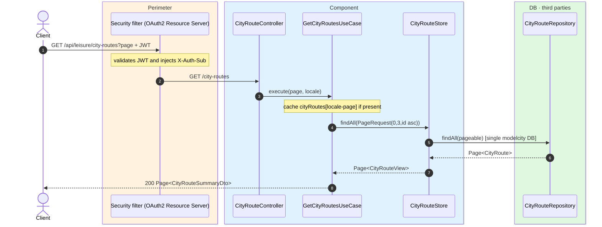

# List city routes

`GET /api/leisure/city-routes` → `GetCityRoutesUseCase`

Returns paginated city routes. **Any authenticated user**. Page size is **3**, sorted by
`id` ascending. Cached in `cityRoutes` keyed by `locale-page`.

## Inputs

**`GET /api/leisure/city-routes?page=0`** — no body.

## Outputs

- **`200 OK`** — `Page<CityRouteSummaryDto>`.

```json
{
  "content": [
    {
      "id": 100,
      "name": "Art route",
      "targetAudience": "FAMILIES",
      "imageUrl": "https://cdn.modelcity.example/routes/art.jpg",
      "estimatedDurationMinutes": 180,
      "placeCount": 3
    }
  ],
  "totalElements": 1,
  "totalPages": 1,
  "number": 0,
  "size": 3
}
```

## Sequence — microservices



## Sequence — monolith


