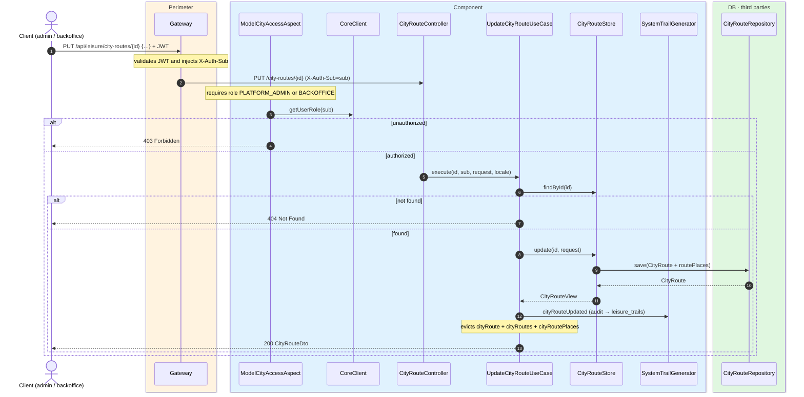
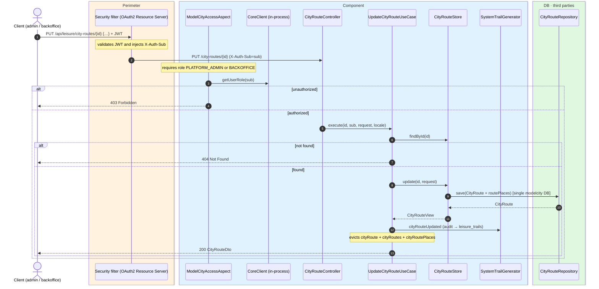

# Replace city route

`PUT /api/leisure/city-routes/{id}` → `UpdateCityRouteUseCase`

Fully replaces an existing city route, including its ordered list of places. **Admin or
backoffice**. If not found, `404`. Returns `200` with `CityRouteDto`.

Audits `CITY_ROUTE_UPDATED` and evicts `cityRoute`, `cityRoutes` and `cityRoutePlaces`.

## Inputs

**`PUT /api/leisure/city-routes/{id}`** — same body as creation.

## Outputs

- **`200 OK`** — `CityRouteDto`.
- **`400 Bad Request`** — validation error.
- **`403 Forbidden`** — not admin or backoffice.
- **`404 Not Found`** — route not found.

## Sequence — microservices

## Sequence — monolith

