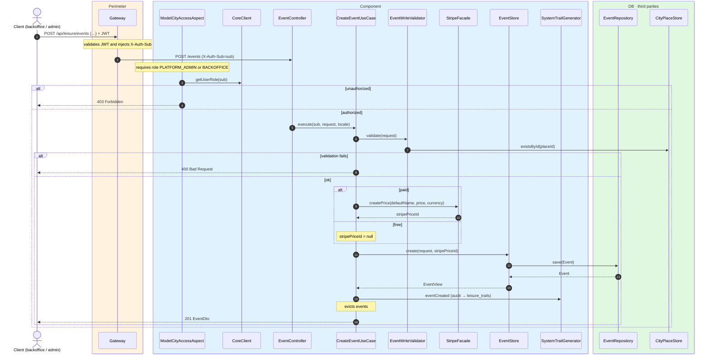
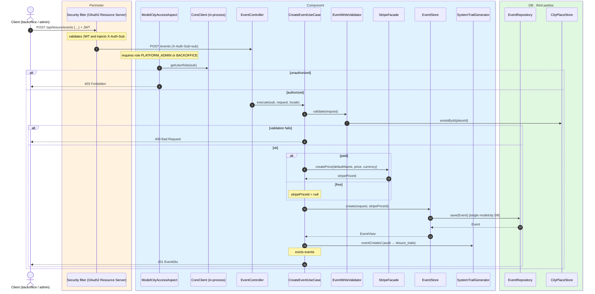

# Create event

`POST /api/leisure/events` → `CreateEventUseCase`

Creates a new cultural or leisure event. **Backoffice or admin**. The request is validated
by `EventWriteValidator`:

- `endsAt` must be after `startsAt`.
- A paid event must require a ticket and have `price > 0`.
- A free event must have `price = 0`.
- `placeId` must reference an existing city place.

For paid events the use case calls `StripeFacade.createPrice` to create a Stripe Product and
Price; the returned `stripePriceId` is stored with the event. Returns `201` with `EventDto`.

Audits `EVENT_CREATED` and evicts `events`.

## Inputs

**`POST /api/leisure/events`**

```json
{
  "placeId": 10,
  "name": {
    "es": "Jazz en el parque",
    "en": "Jazz in the park"
  },
  "description": {
    "es": "Una tarde de jazz en vivo.",
    "en": "An evening of live jazz."
  },
  "eventType": "MUSIC",
  "requiresTicket": true,
  "paid": true,
  "price": 25.00,
  "currency": "EUR",
  "capacity": 200,
  "startsAt": "2026-08-10T19:00:00",
  "endsAt": "2026-08-10T22:00:00",
  "photoUrls": ["https://cdn.modelcity.example/events/jazz-1.jpg"]
}
```

## Outputs

- **`201 Created`** — `EventDto`.
- **`400 Bad Request`** — validation error or Stripe price creation failure.
- **`403 Forbidden`** — not backoffice or admin.

## Sequence — microservices



## Sequence — monolith


