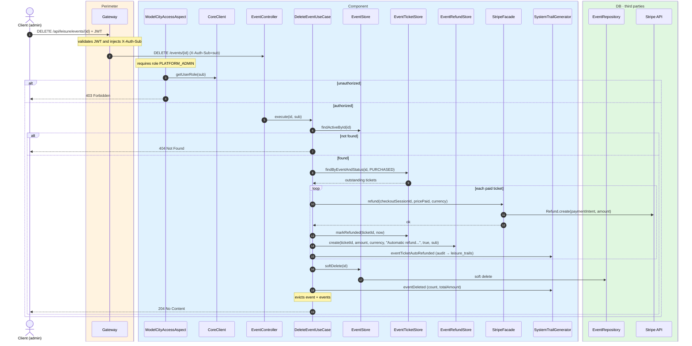
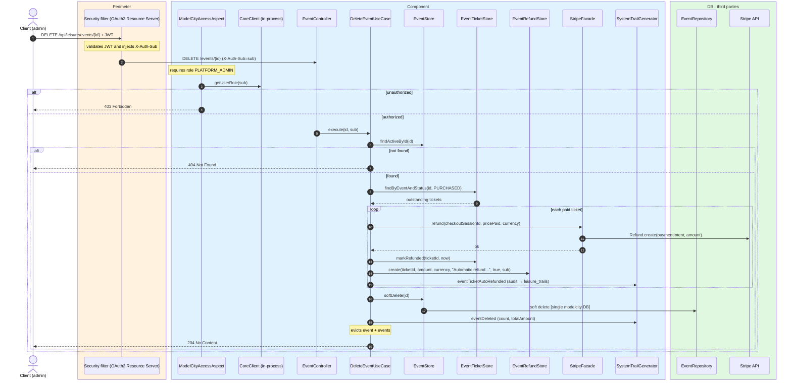

# Delete event

`DELETE /api/leisure/events/{id}` → `DeleteEventUseCase`

Soft-deletes an event and automatically refunds all outstanding paid tickets in status
`PURCHASED`. **Admin only**. If the event is not active, `404`. On success, `204 No Content`.

For each outstanding ticket the use case:

1. Calls `StripeFacade.refund` using the stored `stripeCheckoutSessionId`.
2. Marks the ticket as `REFUNDED`.
3. Records an automatic refund and audits `EVENT_TICKET_AUTO_REFUNDED`.

Then it soft-deletes the event and audits `EVENT_DELETED` with the ticket count and total
refunded amount.

## Inputs

**`DELETE /api/leisure/events/{id}`** — no body.

## Outputs

- **`204 No Content`** — event deleted and tickets refunded.
- **`403 Forbidden`** — not admin.
- **`404 Not Found`** — event not found.
- **`502 Bad Gateway`** — Stripe refund fails.

## Sequence — microservices

## Sequence — monolith

