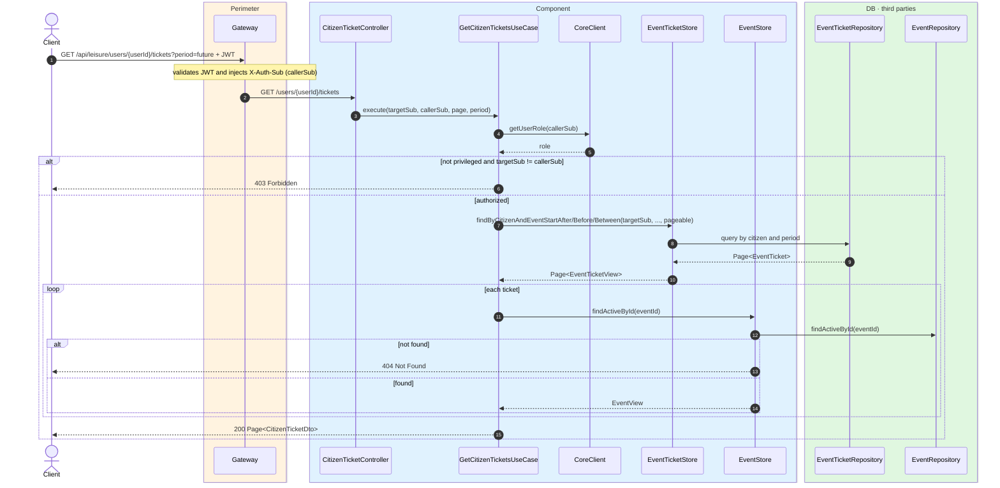
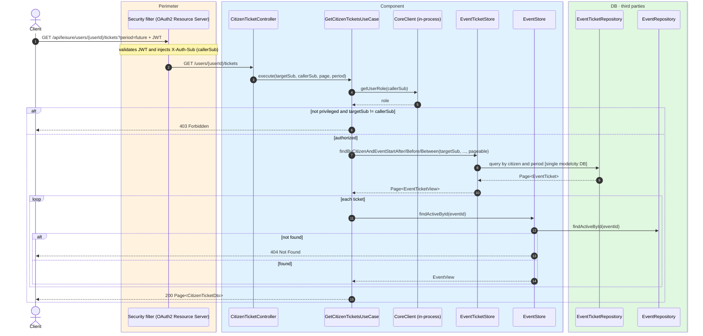

# Citizen ticket history

`GET /api/leisure/users/{userId}/tickets` → `GetCitizenTicketsUseCase`

Returns the paginated ticket history of a citizen. **Any authenticated user**. Citizens may
only query their own `userId`; admin and backoffice may query any user.

Optional `period` filter:

- `week` — current week (from today up to next Sunday).
- `future` — after the current week.
- `past` — before today.

Default page size is **20**, sorted by `purchasedAt` descending. The response includes event
name, start date and photo.

## Inputs

**`GET /api/leisure/users/{userId}/tickets?period=future&page=0`** — no body.

## Outputs

- **`200 OK`** — `Page<CitizenTicketDto>`.
- **`403 Forbidden`** — trying to view another citizen's tickets without admin/backoffice role.
- **`404 Not Found`** — event referenced by a ticket is no longer active.

### Public view (citizen viewing own history)

```json
{
  "content": [
    {
      "id": 1001,
      "eventId": 300,
      "pricePaid": 25.00,
      "currency": "EUR",
      "status": "PAID",
      "purchasedAt": "2026-07-24T18:00:00",
      "stripeCheckoutSessionId": "cs_test_a1...",
      "eventName": "Jazz in the park",
      "eventStart": "2026-08-10",
      "eventPhoto": "https://cdn.modelcity.example/events/jazz-1.jpg"
    }
  ],
  "totalElements": 1,
  "totalPages": 1,
  "number": 0,
  "size": 20
}
```

### Privileged view (admin / backoffice)

Same as above plus `citizenSub` and `citizenName`.

## Sequence — microservices



## Sequence — monolith


