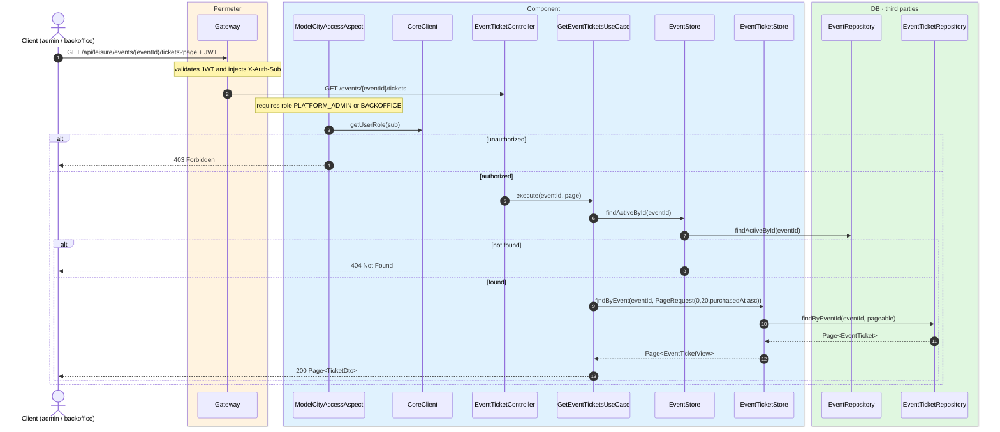
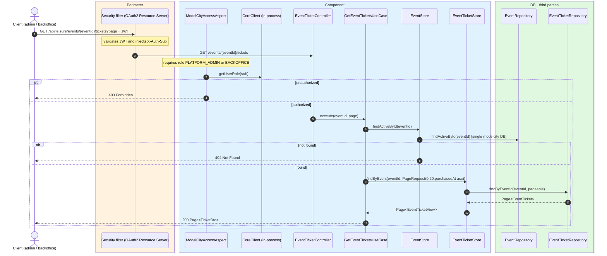

# List event tickets

`GET /api/leisure/events/{eventId}/tickets` → `GetEventTicketsUseCase`

Returns paginated tickets for an event. **Admin or backoffice**. Page size is **20**, sorted
by `purchasedAt` ascending. The response uses `TicketDto.privilegedView`, so it includes
citizen identification.

If the event is not active, `404`.

## Inputs

**`GET /api/leisure/events/{eventId}/tickets?page=0`** — no body.

## Outputs

- **`200 OK`** — `Page<TicketDto>`.
- **`403 Forbidden`** — not admin or backoffice.
- **`404 Not Found`** — event not found.

```json
{
  "content": [
    {
      "id": 1001,
      "eventId": 300,
      "pricePaid": 25.00,
      "currency": "EUR",
      "status": "PAID",
      "purchasedAt": "2026-07-24T18:00:00",
      "stripeCheckoutSessionId": "cs_test_a1...",
      "citizenSub": "auth0|123456",
      "citizenName": "Ana García"
    }
  ],
  "totalElements": 1,
  "totalPages": 1,
  "number": 0,
  "size": 20
}
```

## Sequence — microservices



## Sequence — monolith


