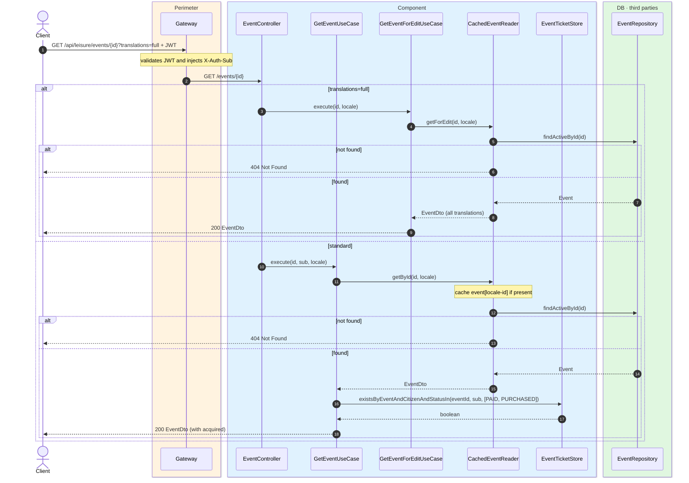
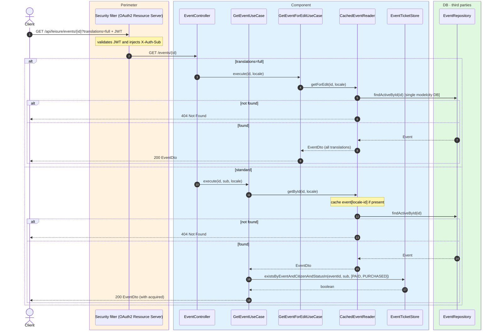

# Event detail

`GET /api/leisure/events/{id}` → `GetEventUseCase`
`GET /api/leisure/events/{id}?translations=full` → `GetEventForEditUseCase`

Returns the detail of an active event. **Any authenticated user**. The standard response
includes an `acquired` boolean that is `true` when the caller already owns an active ticket
for the event (`PAID` or `PURCHASED`).

`?translations=full` returns every locale of `name` and `description` (admin editing).

Standard detail is cached in `event` keyed by `locale-id` (via `CachedEventReader`). The
`acquired` flag is resolved per request from `eventTicketStore` and overlaid on top of the
cached event.

## Inputs

**`GET /api/leisure/events/{id}`** — no body.

## Outputs

- **`200 OK`** — `EventDto`.
- **`404 Not Found`** — event not found.

```json
{
  "id": 300,
  "placeId": 10,
  "name": "Jazz in the park",
  "description": "An evening of live jazz in the city gardens.",
  "eventType": "MUSIC",
  "requiresTicket": true,
  "paid": true,
  "price": 25.00,
  "currency": "EUR",
  "capacity": 200,
  "startsAt": "2026-08-10T19:00:00",
  "endsAt": "2026-08-10T22:00:00",
  "stripePriceId": "price_1Q...",
  "photoUrls": ["https://cdn.modelcity.example/events/jazz-1.jpg"],
  "acquired": false
}
```

## Sequence — microservices



## Sequence — monolith


