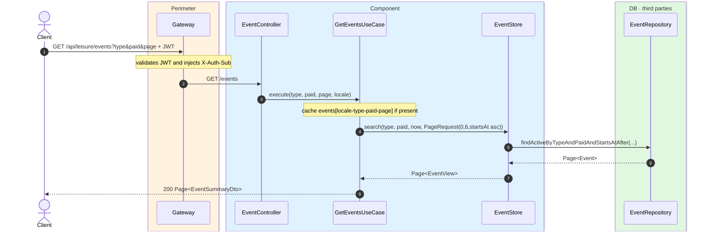
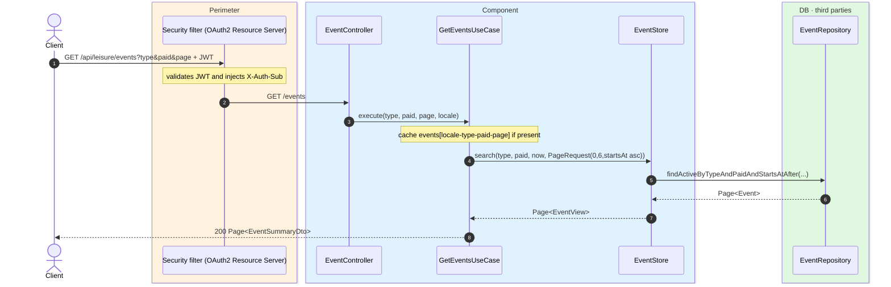

# List events

`GET /api/leisure/events` → `GetEventsUseCase`

Returns paginated active upcoming events. **Any authenticated user**. Optional filters:
`type` (one of `MUSIC`, `NIGHTLIFE`, `PERFORMING_ARTS`, `HOBBIES`, `BUSINESS`,
`FOOD_AND_DRINK`, `OTHER`) and `paid` (`true`/`false`). Page size is **6**, sorted by
`startsAt` ascending. Only events with `startsAt >= now` are returned.

Cached in `events` keyed by `locale-type-paid-page`.

## Inputs

**`GET /api/leisure/events?type=MUSIC&paid=false&page=0`** — no body.

## Outputs

- **`200 OK`** — `Page<EventSummaryDto>`.

```json
{
  "content": [
    {
      "id": 300,
      "placeId": 10,
      "name": "Jazz in the park",
      "eventType": "MUSIC",
      "requiresTicket": true,
      "paid": true,
      "price": 25.00,
      "currency": "EUR",
      "startsAt": "2026-08-10T19:00:00",
      "endsAt": "2026-08-10T22:00:00",
      "stripePriceId": "price_1Q...",
      "photoUrl": "https://cdn.modelcity.example/events/jazz-1.jpg"
    }
  ],
  "totalElements": 1,
  "totalPages": 1,
  "number": 0,
  "size": 6
}
```

## Sequence — microservices



## Sequence — monolith


