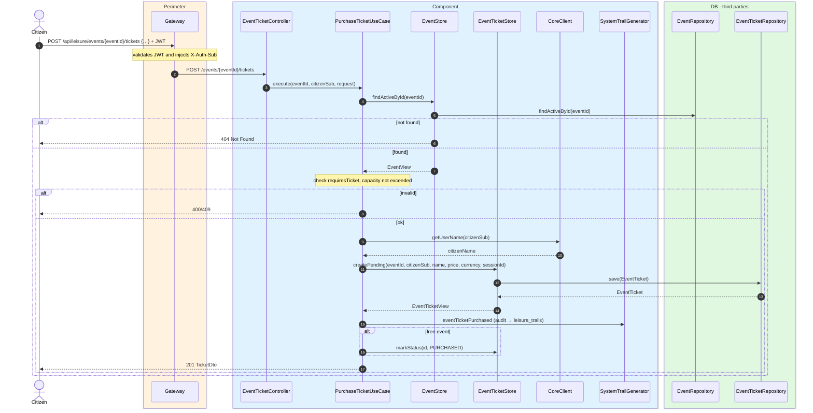
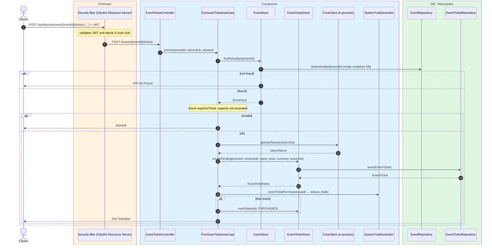

# Purchase ticket (web)

`POST /api/leisure/events/{eventId}/tickets` → `PurchaseTicketUseCase`

Purchases an event ticket using the web Checkout Session flow. **Any authenticated user**
(citizen). The request body may contain `checkoutSessionId` for paid events; free events do
not require it.

Validation:

- The event must be active and `requiresTicket = true`.
- If `capacity` is set, the number of active tickets (`PENDING`, `PAID`, `PURCHASED`) must
  not reach it.
- For paid events, `checkoutSessionId` is required.

For a **free** event the ticket is created in `PURCHASED` status immediately. For a **paid**
event a `PENDING` ticket is created; Stripe confirms the payment asynchronously and updates
status via the [Stripe webhook](stripe-webhook.md).

The use case resolves the citizen name from `CoreClient` and stores it. Audits
`EVENT_TICKET_PURCHASED`.

## Inputs

**`POST /api/leisure/events/{eventId}/tickets`**

```json
{
  "checkoutSessionId": "cs_test_a1..."
}
```

For a free event, the body can be `{}` or omitted.

## Outputs

- **`201 Created`** — `TicketDto` (privileged view).
- **`400 Bad Request`** — event does not require a ticket, or missing `checkoutSessionId` for paid event.
- **`404 Not Found`** — event not found.
- **`409 Conflict`** — event sold out.

```json
{
  "id": 1001,
  "eventId": 300,
  "pricePaid": 25.00,
  "currency": "EUR",
  "status": "PENDING",
  "purchasedAt": "2026-07-24T18:00:00",
  "stripeCheckoutSessionId": "cs_test_a1...",
  "citizenSub": "auth0|123456",
  "citizenName": "Ana García"
}
```

## Sequence — microservices



## Sequence — monolith


