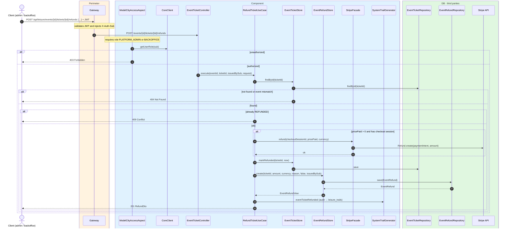
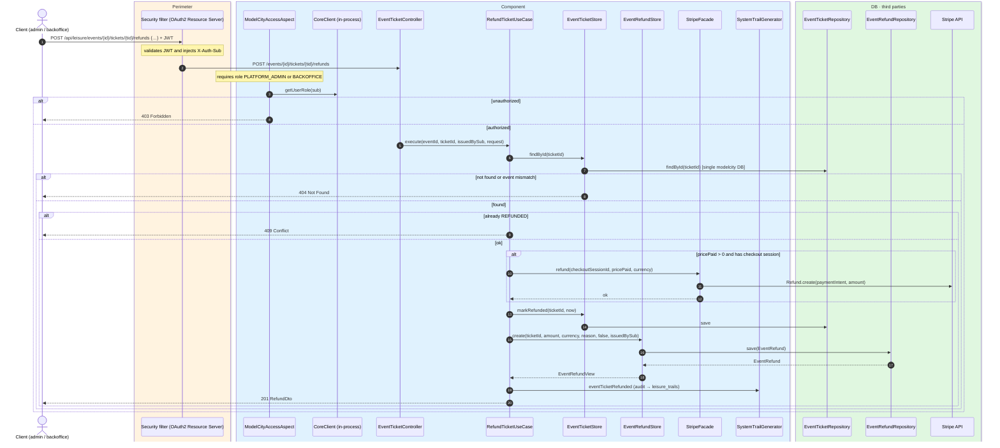

# Refund ticket

`POST /api/leisure/events/{eventId}/tickets/{ticketId}/refunds` → `RefundTicketUseCase`

Issues a refund for a paid ticket. **Admin or backoffice**. The body is optional and may
contain a `reason`.

Validation:

- The ticket must exist and belong to the event.
- The ticket must not already be `REFUNDED`.
- If `pricePaid > 0` and a `stripeCheckoutSessionId` is present, a Stripe refund is created
  from the payment intent associated with the session.

The ticket is marked `REFUNDED`, a refund record is stored, and `EVENT_TICKET_REFUNDED` is
audited.

## Inputs

**`POST /api/leisure/events/{eventId}/tickets/{ticketId}/refunds`**

```json
{
  "reason": "Customer request"
}
```

The body is optional.

## Outputs

- **`201 Created`** — `RefundDto`.
- **`403 Forbidden`** — not admin or backoffice.
- **`404 Not Found`** — ticket not found.
- **`409 Conflict`** — ticket already refunded.
- **`502 Bad Gateway`** — Stripe refund fails.

```json
{
  "id": 500,
  "ticketId": 1001,
  "amount": 25.00,
  "currency": "EUR",
  "reason": "Customer request",
  "automatic": false,
  "issuedBySub": "auth0|admin01",
  "refundedAt": "2026-07-24T19:00:00"
}
```

## Sequence — microservices



## Sequence — monolith


