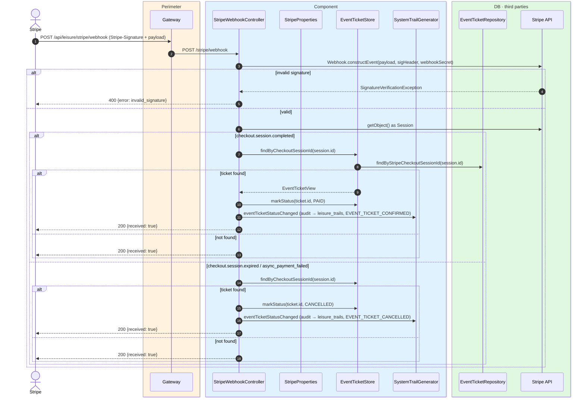
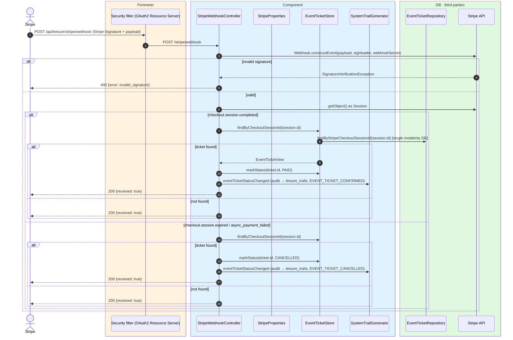

# Stripe webhook

`POST /api/leisure/stripe/webhook` → `StripeWebhookController`

Receives asynchronous Stripe lifecycle events for the **web Checkout Session** payment flow.
This endpoint is **unauthenticated**; security relies on Stripe signature verification with
the configured `webhookSecret` (`StripeProperties`).

Processed event types:

- `checkout.session.completed` → ticket status set to `PAID`.
- `checkout.session.expired` → ticket status set to `CANCELLED`.
- `checkout.session.async_payment_failed` → ticket status set to `CANCELLED`.

Other event types are ignored. The response is always `200 OK` with `{"received": true}`
once the signature is valid, even if the ticket is not found (logged as a warning).

Each status change audits `EVENT_TICKET_CONFIRMED` (for `PAID`) or `EVENT_TICKET_CANCELLED`
(for `CANCELLED`). The actor is the citizen who owns the ticket.

## Inputs

**`POST /api/leisure/stripe/webhook`**

```http
Stripe-Signature: t=1234567890,v1=...
Content-Type: application/json
```

Body is the raw Stripe event JSON.

## Outputs

- **`200 OK`** — `{"received": true}`.
- **`400 Bad Request`** — invalid signature or invalid payload.

## Sequence — microservices



## Sequence — monolith


